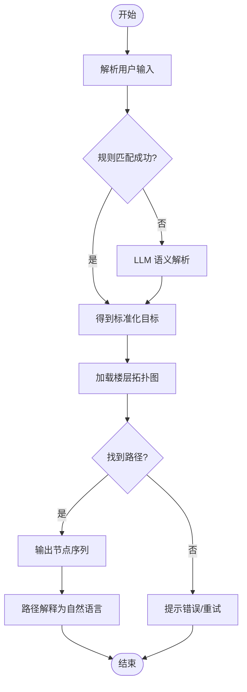

# 智能层 (AI)

## 功能职责

执行智能决策和规划，将用户意图转化为可执行的路径方案。

## 核心模块

### 路径规划

采用 Dijkstra/A* 算法，在楼宇拓扑图上寻找最短路径。

- 输入：起点节点、终点节点、楼层连接节点
- 输出：节点序列、楼层切换指令
- 扩展：跨楼层权重区分（电梯 vs 楼梯）

### 语义理解

规则匹配为主，LLM 辅助增强：

- **规则匹配**：字符串匹配、别名词典、模糊匹配
- **LLM 增强**：用户指令理解、任务转化

### 用户意图解析

将自然语言输入转化为标准目标（楼栋/楼层/房间）。

## 处理流程

## 算法设计

!!! info "A* 算法优势"
    - 楼宇拓扑图为离散图结构，算法复杂度可控
    - 支持启发式函数优化
    - 支持楼层切换权重（电梯权重 < 楼梯权重）
