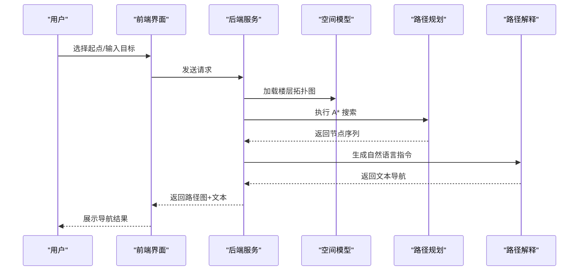

# 行为层 (Embodied Output)

## 功能职责

将智能层的决策转化为具体的行为指令，供用户理解和执行。

## 输出形式

- **导航提示**：转向/楼层切换等文本指令
- **路径可视化**：楼层平面图上高亮显示路径
- **AR 指引**（可扩展）：增强现实导航指示

## 交互流程

## 导航输出示例

> "从一层东入口进入 -> 沿走廊直行约 20 米 -> 左转至楼梯间 -> 上至四层 -> 出楼梯后右转 -> 前行至 D402"

## 前端设计

页面采用三段式结构：

- **顶部**：项目标题和状态显示
- **中部**：起点选择和目标输入
- **底部**：导航结果显示和操作按钮

核心功能模块：

1. **起点输入**：手动选择或扫码定位
2. **目标输入**：房间号或语义描述
3. **路径展示**：静态路径高亮显示
4. **分步导航**：模板生成的文本导航
