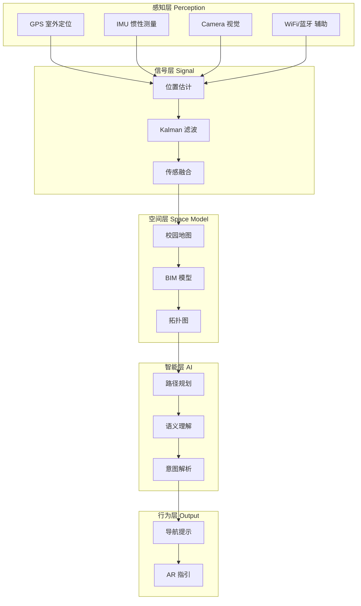

# 五层系统架构

项目采用分层架构设计，从底层感知到顶层行为输出，形成完整的系统闭环。

## 各层详细文档

- [感知层 (Perception)](perception.md)
- [信号层 (Signal)](signal.md)
- [空间层 (Space Model)](space.md)
- [智能层 (AI)](ai.md)
- [行为层 (Embodied Output)](behavior.md)
