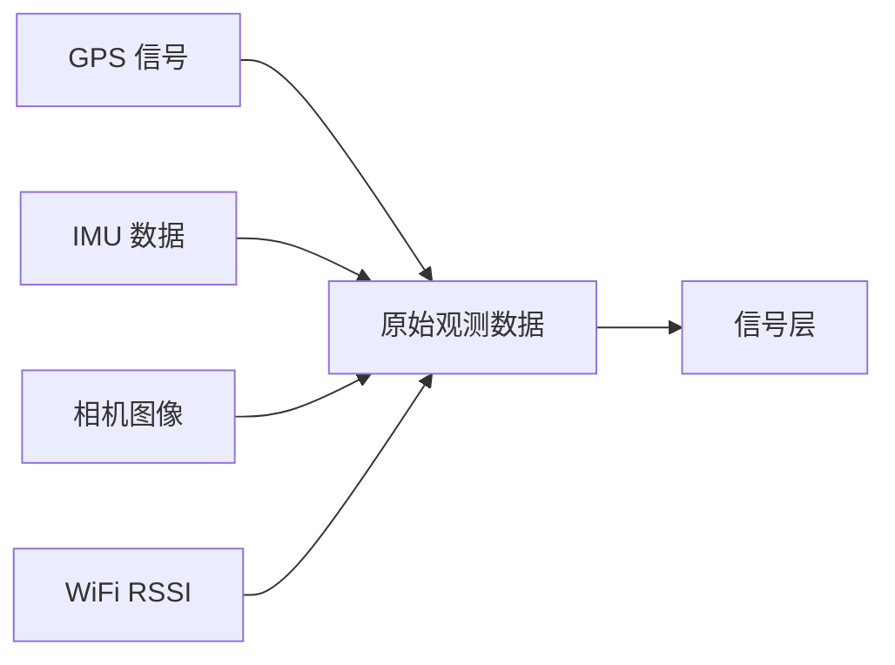

# 感知层 (Perception)

## 功能职责

收集环境信息和位置数据，为后续信号层提供原始观测信号。

## 传感器组成

| 传感器 | 场景 | 功能 |
|--------|------|------|
| GPS | 室外 | 提供全球定位坐标 |
| IMU | 室内外 | 提供运动状态信息（加速度、角速度） |
| Camera | 室内外 | 视觉识别（二维码、环境特征） |
| WiFi/蓝牙 | 室内 | 辅助定位（信号强度指纹） |

## 实施要点

!!! tip "教学原型方案"
    在教学原型中，定位方案采用**二维码扫码（QR Code）**替代复杂室内高精度定位，直接获取"节点 ID"。这种方案：
    
    - 绕过复杂的室内高精度定位难题
    - 直接获取离散节点信息
    - 简化系统复杂度，聚焦核心逻辑

## 数据流

