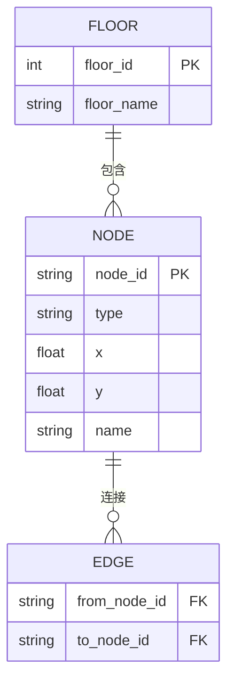

# 空间层 (Space Model)

## 功能职责

构建和维护空间模型，承载几何、拓扑与语义信息。

## 数据来源

- **官方 3D 平台**：提供 1-10 层完整平面图
- **BIM 模型**：建筑信息模型，包含楼内结构
- **拓扑图**：楼栋连接关系

## 数据结构

每层对应一个 JSON 对象，包含节点列表和边列表：



### 节点类型

| 类型 | 说明 | 示例 |
|------|------|------|
| `room` | 房间 | A101, B302, D402 |
| `corridor` | 走廊 | corridor_1F_main |
| `stairs` | 楼梯 | stairs_A_1F |
| `elevator` | 电梯 | elevator_A_1F |
| `entrance` | 出入口 | entrance_east |

### JSON 示例

```json
{
  "floor": "4F",
  "nodes": [
    {"id": "D402", "type": "room", "x": 120, "y": 80, "name": "D402"},
    {"id": "corridor_4F_main", "type": "corridor", "x": 100, "y": 100},
    {"id": "stairs_A_4F", "type": "stairs", "x": 30, "y": 100}
  ],
  "edges": [
    ["D402", "corridor_4F_main"],
    ["corridor_4F_main", "stairs_A_4F"]
  ]
}
```

## 实施建议

!!! tip "课堂实施"
    课堂不追求完整标注，可由教师提供样例（2-3 层或核心区域），学生重点在于系统理解与实现。
