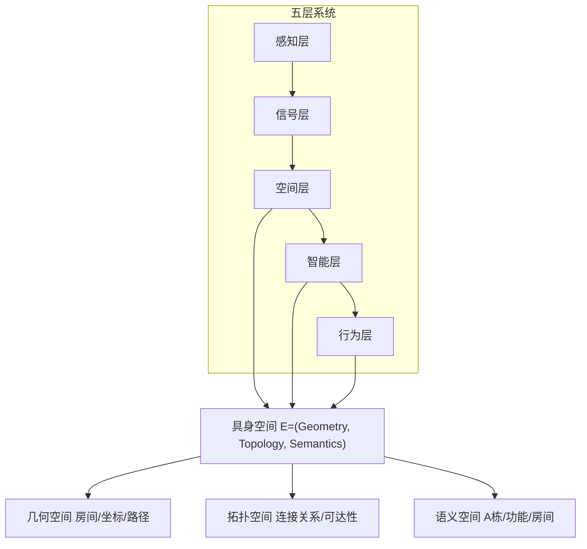
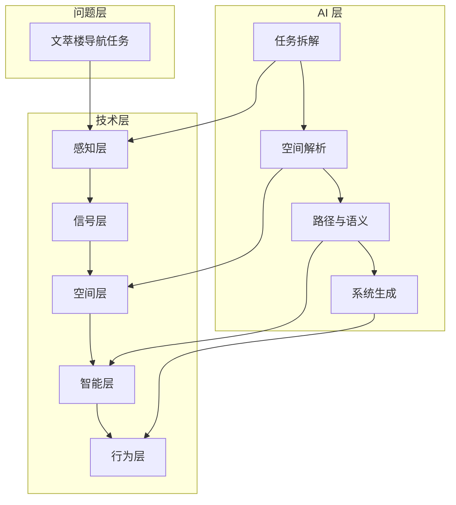

# 系统架构设计

本设计文档围绕"面向复杂楼宇群的室内外一体化具身导航系统"展开，聚焦五层系统架构与三层空间模型。

## 设计理念

系统以"具身空间 E = (Geometry, Topology, Semantics)"为核心，实现从感知到行为的跨层映射与协同。

## 架构概述

项目采用"问题驱动—技术闭环—AI 贯穿"的三层结构：

- **问题层**：以文萃楼室内外导航为真实任务
- **技术层**：感知 -> 信号处理 -> 空间建模 -> 路径规划 -> 行为输出
- **AI 层**：贯穿全流程的人 + AI 协同

## 核心组件

| 层次 | 核心功能 | 技术实现 |
|------|---------|---------|
| 感知层 | 收集环境信息 | GPS/IMU/Camera/WiFi |
| 信号层 | 数据处理融合 | Kalman 滤波、传感融合 |
| 空间层 | 空间模型构建 | BIM + 拓扑图 |
| 智能层 | 路径规划决策 | A* 算法 + 语义理解 |
| 行为层 | 导航指令输出 | 导航提示、AR 指引 |

## 文档索引

- [五层系统架构](five-layers/index.md) - 感知层、信号层、空间层、智能层、行为层详细设计
- [三层空间模型](space-model/index.md) - 物理空间、语义空间、行为空间与统一具身空间
- [技术实现方案](tech/index.md) - 空间建模、语义映射、路径规划、定位方案
