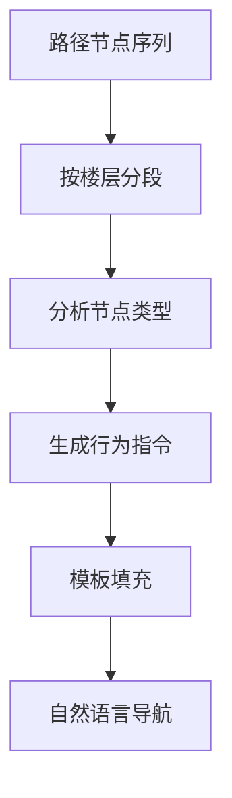

# 行为空间建模

## 概述

行为空间建模将路径规划结果转化为人类可理解、可执行的行为指令序列。

## 行为类型

| 行为类型 | 说明 | 示例 |
|---------|------|------|
| 直行 | 沿当前方向前进 | "沿走廊直行约 20 米" |
| 转向 | 改变前进方向 | "左转进入 A 走廊" |
| 上楼 | 通过楼梯/电梯上行 | "上楼至 4 层" |
| 下楼 | 通过楼梯/电梯下行 | "下楼至 1 层" |
| 到达 | 抵达目的地 | "到达 D402 教室" |

## 行为生成流程

## 导航指令示例

对于从 1F 大厅到 4F D402 的路径：

1. 从一层主走廊出发
2. 沿 A 走廊前行至楼梯 A
3. 通过楼梯上至 4 层
4. 沿走廊前行至 D402

## 认知路径 vs 地图路径

!!! warning "关键认知"
    人类认知路径 ≠ 地图路径。系统需要在几何最优路径的基础上，考虑人类的空间认知习惯，生成更自然的导航指令。
