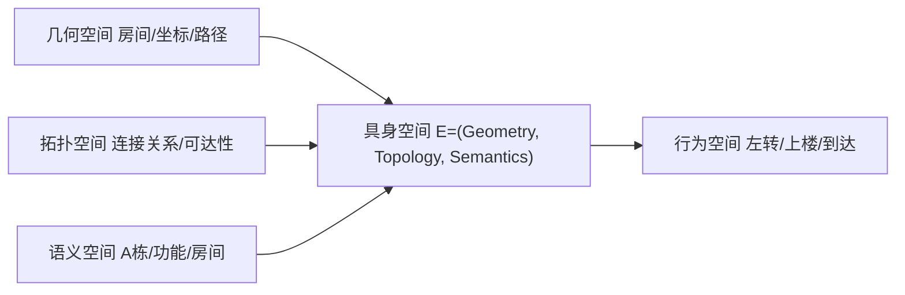

# 统一具身空间

## 概述

统一具身空间是三层空间模型的最终集成，将几何空间、拓扑空间和语义空间有机统一。

## 数学表达

$$E = (Geometry, Topology, Semantics)$$

- **Geometry**：房间/坐标的空间几何 —— 描述"在哪里"
- **Topology**：楼层连接关系的拓扑结构 —— 描述"怎么走"
- **Semantics**：功能语义 —— 描述"是什么"

## 空间集成

## 从"位置计算"到"行为引导"

传统导航系统主要在几何空间中工作，计算最短路径。具身导航系统则需要：

| 维度 | 传统导航 | 具身导航 |
|------|---------|---------|
| 输入 | 坐标 (x, y) | 语义描述 "去教务处" |
| 处理 | 几何距离最优 | 多维度综合决策 |
| 输出 | 坐标序列 | 行为指令序列 |
| 体验 | 看地图找路 | 跟随指令行走 |

## 跨层跃迁

具身空间实现了从"位置计算"到"行为引导"的跨层跃迁：

1. **几何层**：确定空间位置关系
2. **拓扑层**：确定可达性和连通性
3. **语义层**：理解空间功能含义
4. **行为层**：输出人类可执行的行为指令

这种跨层跃迁是具身智能系统区别于传统导航系统的核心特征。
