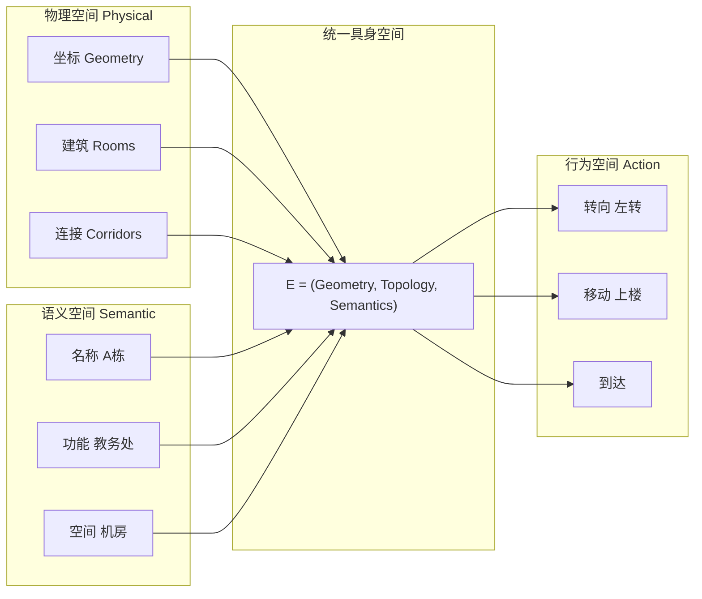

# 三层空间模型

项目构建了完整的三层空间模型，将物理空间、语义空间和行为空间统一为具身空间。

## 空间模型详情

- [物理空间建模](physical.md) - 坐标、楼栋、路径的几何表示
- [语义空间建模](semantic.md) - 名称、功能、区域的语义表达
- [行为空间建模](action.md) - 转向、移动、到达的行为指令
- [统一具身空间](embodied.md) - E = (Geometry, Topology, Semantics)

## 数学表达

$$E = (Geometry, Topology, Semantics)$$

- **Geometry**：房间/坐标的空间几何
- **Topology**：楼层连接关系的拓扑结构
- **Semantics**：A 栋/教室/办公室的功能语义
