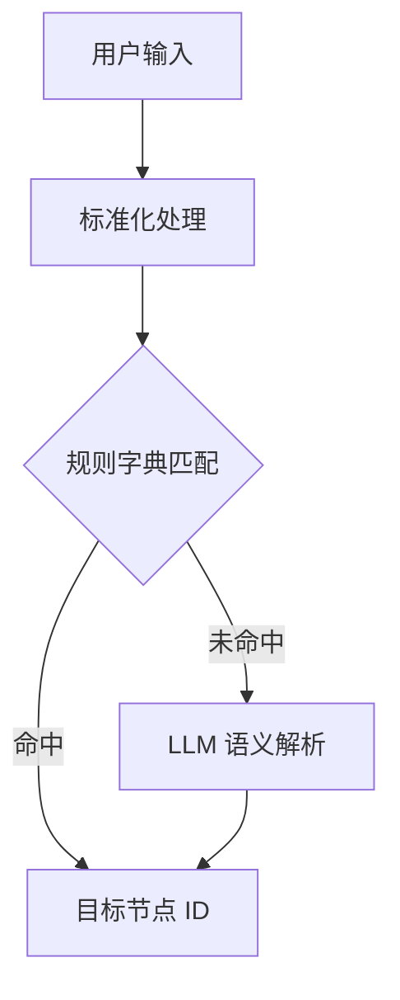

# 语义空间建模

## 概述

语义空间建模将物理空间中的节点赋予人类可理解的含义和功能描述。

## 语义层次

### 名称语义

将房间编号映射为功能名称：

| 房间编号 | 功能名称 |
|---------|---------|
| A101 | 教室 101 |
| B101 | 服务中心 |
| A301 | 生物实验室 |
| D402 | 教室 D402 |
| A701 | 计算机机房 |

### 功能语义

按功能分类：

- **教学区域**：教室、实验室、机房
- **办公区域**：院长办公室、教务处
- **公共区域**：服务中心、自习室、报告厅

### 位置语义

- **A 区/B 区**：左侧/右侧区域划分
- **楼梯 A/B**：两组垂直交通
- **电梯 A/B**：两组电梯

## 语义映射策略

### 映射规则

- **精确匹配**：`"D402"` -> `D402`
- **功能匹配**：`"教务办公室"` -> `D402`
- **别名匹配**：`"机房"` -> `A701`
- **模糊匹配**：`"实验室"` -> 最近的实验室节点
