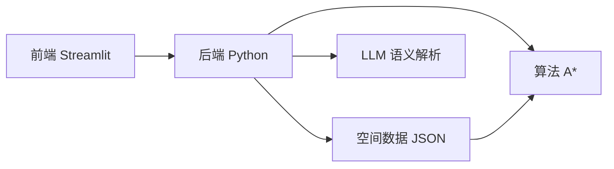

# 技术实现方案

本部分详细介绍系统各核心模块的技术实现方案。

## 模块概览

| 模块 | 功能 | 核心技术 |
|------|------|---------|
| [空间建模](spatial.md) | 构建楼层拓扑图 | JSON + 图结构 |
| [语义映射](semantic-mapping.md) | 自然语言 -> 节点 ID | 规则 + LLM |
| [路径规划](pathfinding.md) | 最短路径搜索 | A* 算法 |
| [定位方案](localization.md) | 确定用户位置 | 二维码扫码 |

## 技术栈

## 实现原则

!!! tip "三大原则"
    1. **先做"能用"，再做"高级"** —— 首版专注核心功能
    2. **规则系统打底，AI 负责增强** —— 确保系统稳定
    3. **先把空间模型做清楚** —— 项目成败的关键
