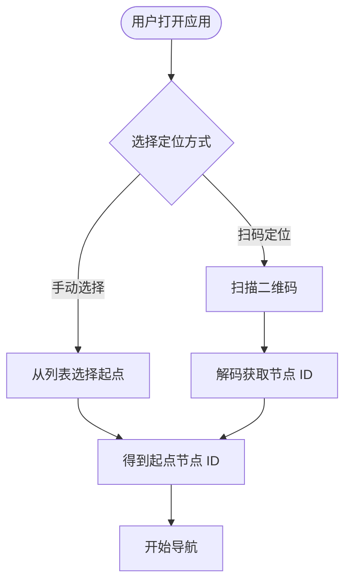

# 定位方案模块

## 方案选择

教学原型采用**二维码扫码定位**方案。

## 选择理由

| 方案 | 优势 | 劣势 |
|------|------|------|
| 二维码扫码 | 简单可靠、精确定位 | 需要预先部署二维码 |
| WiFi 指纹 | 无需额外设备 | 精度低、需要训练 |
| 蓝牙信标 | 精度较高 | 需要购买硬件 |
| IMU 惯导 | 无需基础设施 | 累积误差大 |

!!! success "推荐方案"
    二维码扫码方案绕过复杂的室内高精度定位难题，直接获取"节点 ID"，将定位问题简化为扫码识别问题。

## 工作流程

## 二维码部署建议

- 在每个楼层的楼梯间、电梯口、走廊交叉口部署二维码
- 二维码内容为节点 ID（如 `stairs_A_4F`）
- 配合楼层平面图标注二维码位置

## 未来扩展

- **V2 阶段**：增加扫码定位功能
- **V4 阶段**：引入 IMU 步行更新，实现简单的行人航迹推算
- **V5 阶段**：多传感器融合定位
