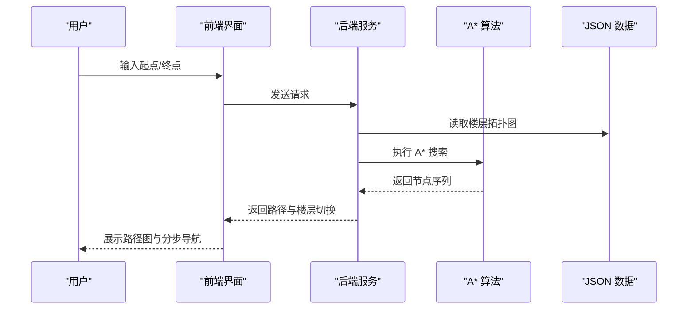
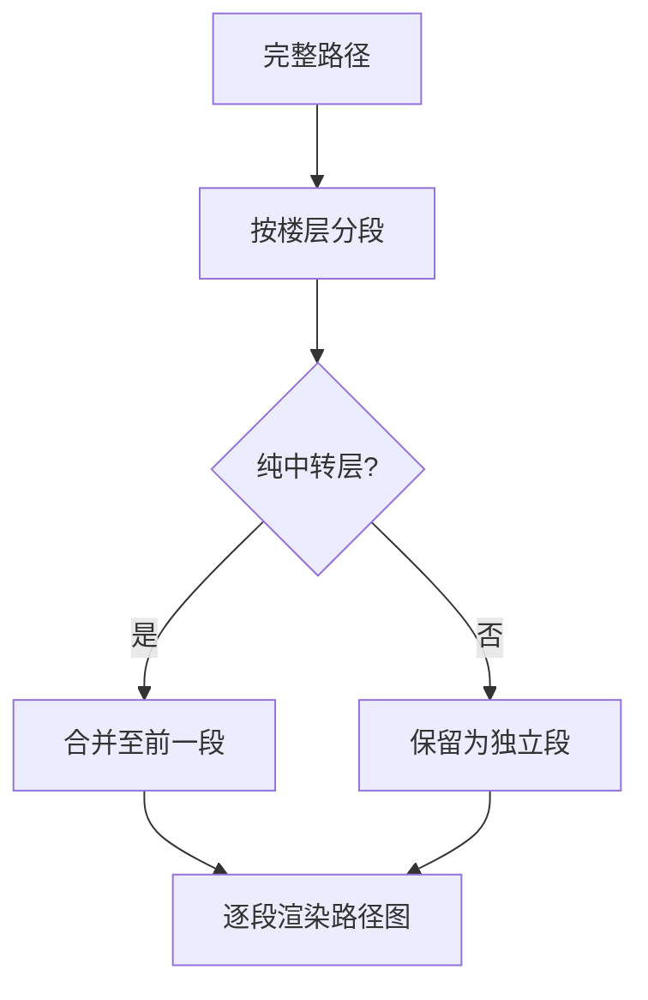

# 路径规划模块

## 算法选择

采用 A* 算法在楼宇拓扑图上进行最短路径搜索。

### 选择理由

- 楼宇拓扑图为离散图结构，A* 算法天然适用
- 支持启发式函数，效率优于 Dijkstra
- 算法相对简单，易于实现和调试

## 输入输出

- **输入**：起点节点 ID、终点节点 ID
- **输出**：节点序列、楼层切换指令

## 算法流程

## 权重设计

| 边类型 | 权重 | 说明 |
|--------|------|------|
| 同层走廊 | 1.0 | 标准行走 |
| 房间-走廊 | 1.0 | 进出房间 |
| 跨层楼梯 | 3.0 | 楼梯换层 |
| 跨层电梯 | 2.0 | 电梯换层（更方便） |

## 多楼层路径处理

当路径跨越多个楼层时，系统将路径按楼层分段显示：

1. **路径分段**：按楼层边界切分路径
2. **中转合并**：跳过纯中转楼层（只有楼梯/电梯节点）
3. **过渡提示**：在楼层切换处显示楼梯/电梯提示

