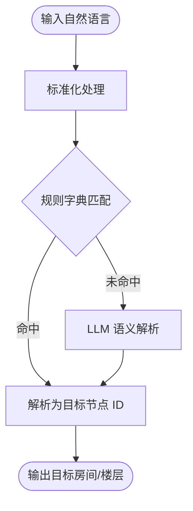

# 语义映射模块

## 功能目标

将自然语言输入（如"D402""教务办公室"）映射到目标房间 ID、所在楼层与所属区域。

## 实施策略

首版采用"规则为主 + LLM 增强"，避免将系统建立在不稳定的大模型输出之上。



## 映射类型

### 精确匹配

直接将房间编号映射到节点 ID：

```json
{"D402": "D402", "A101": "A101", "B301": "B301"}
```

### 功能映射

将功能名称映射到房间：

```json
{
  "教务办公室": "D402",
  "计算机机房": "A701",
  "生物实验室": "A301",
  "服务中心": "B101"
}
```

### 别名匹配

支持多种表达：

```json
{
  "机房": "A701",
  "实验室": "A301",
  "自习室": "B801",
  "报告厅": "A1002"
}
```

### 位置关键词

```json
{
  "A电梯": "elevator_A_{floor}",
  "B楼梯": "stairs_B_{floor}",
  "A走廊": "corridor_{floor}_A"
}
```

## 语义映射数据

系统当前包含 39 条语义映射，覆盖 10 层楼的主要房间和功能区域。映射数据存储在 `data/semantic_mapping.json` 中。
