# 空间建模模块

## 数据来源

官方 3D 平台提供的 1-10 层平面图，提取房间、走廊、楼梯、电梯、出入口等元素。

## 数据结构

每层一个 JSON 对象，包含楼层编号、节点列表和边列表。

```mermaid
erDiagram
    FLOOR {
        int floor_id PK
        string floor_name
    }
    NODE {
        string node_id PK
        string type
        float x
        float y
        string name
    }
    EDGE {
        string from_node_id FK
        string to_node_id FK
    }
    FLOOR ||--o{ NODE : "包含"
    NODE ||--o{ EDGE : "连接"
```

## 建模策略

以"样例先行"方式：教师提供 2-3 层样例与若干目标房间，学生集中于系统理解与实现。

### A/B 双区结构

每层采用统一的 A/B 双区布局：

- **A 区**（左侧，x = 30-50）：楼梯 A、电梯 A、A 区走廊、A 区房间
- **主走廊**（中央，x = 100）：连接 A/B 两区
- **B 区**（右侧，x = 150-170）：楼梯 B、电梯 B、B 区走廊、B 区房间

### 跨层连接

4 条垂直交通链：

| 链路 | 类型 | 连接 |
|------|------|------|
| 楼梯 A | stairs | 1F-10F 逐层连接 |
| 楼梯 B | stairs | 1F-10F 逐层连接 |
| 电梯 A | elevator | 1F-10F 逐层连接 |
| 电梯 B | elevator | 1F-10F 逐层连接 |

## 节点 ID 命名规范

- 走廊：`corridor_{楼层}_main/A/B`
- 楼梯：`stairs_A/B_{楼层}`
- 电梯：`elevator_A/B_{楼层}`
- 房间：`A101`, `B302`, `D402` 等
