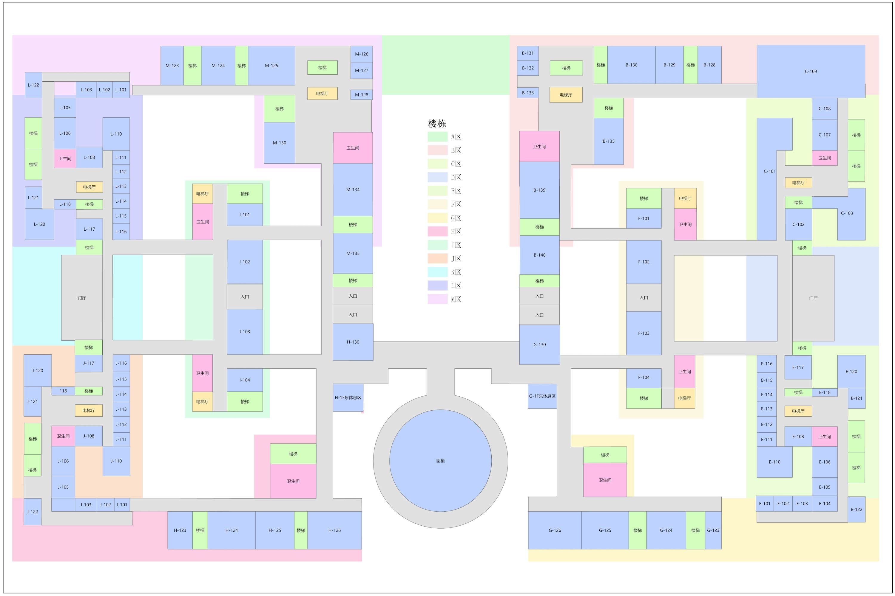
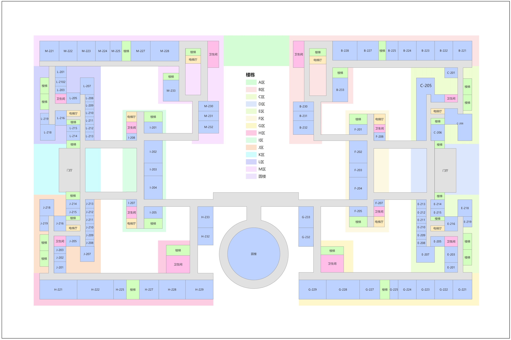
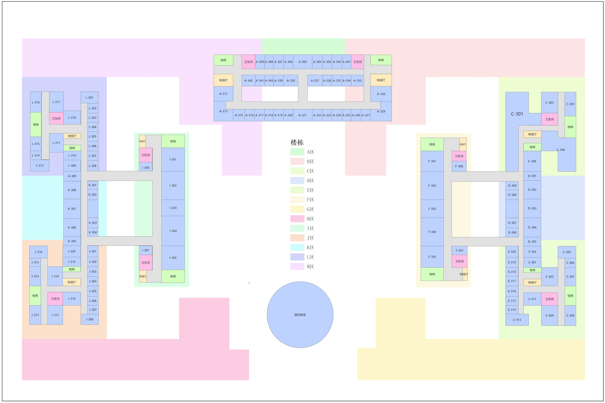
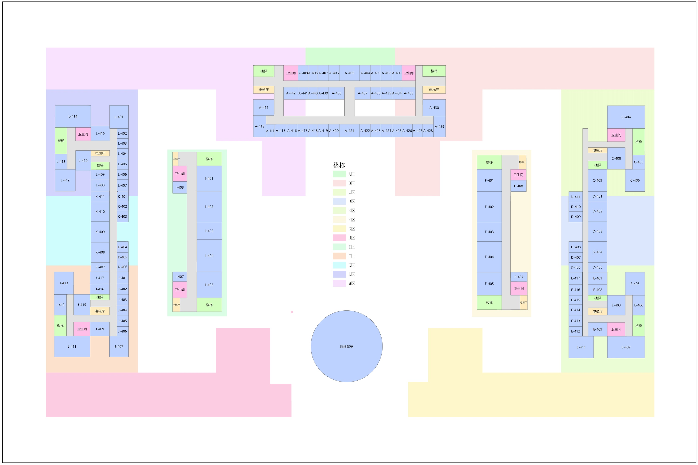
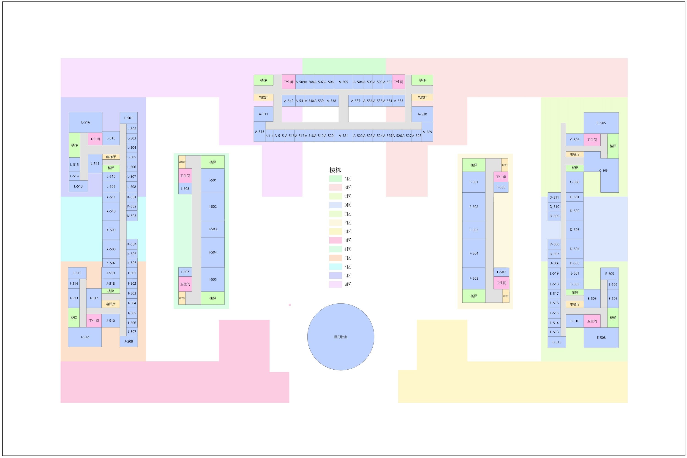
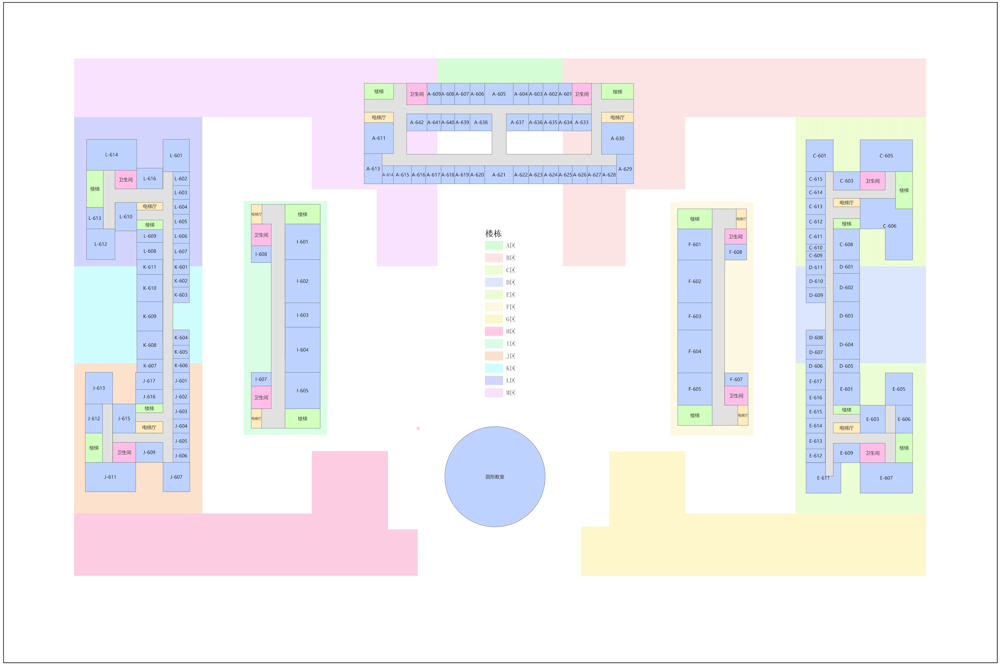
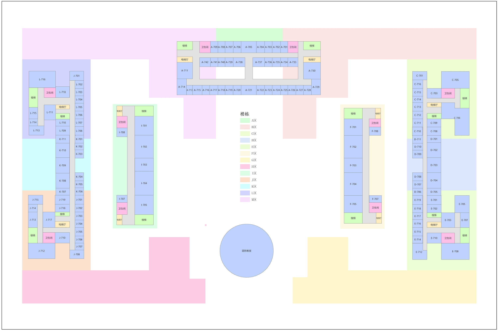
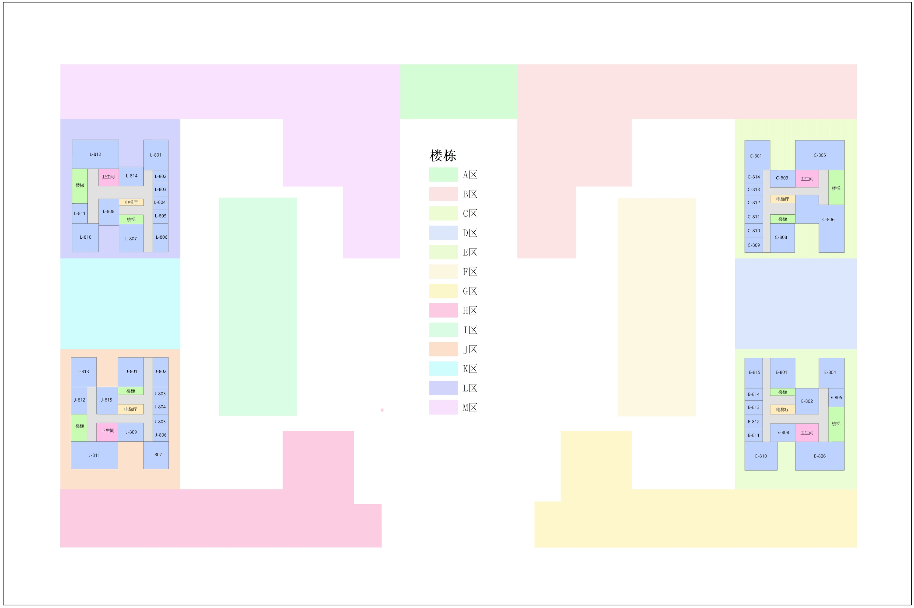
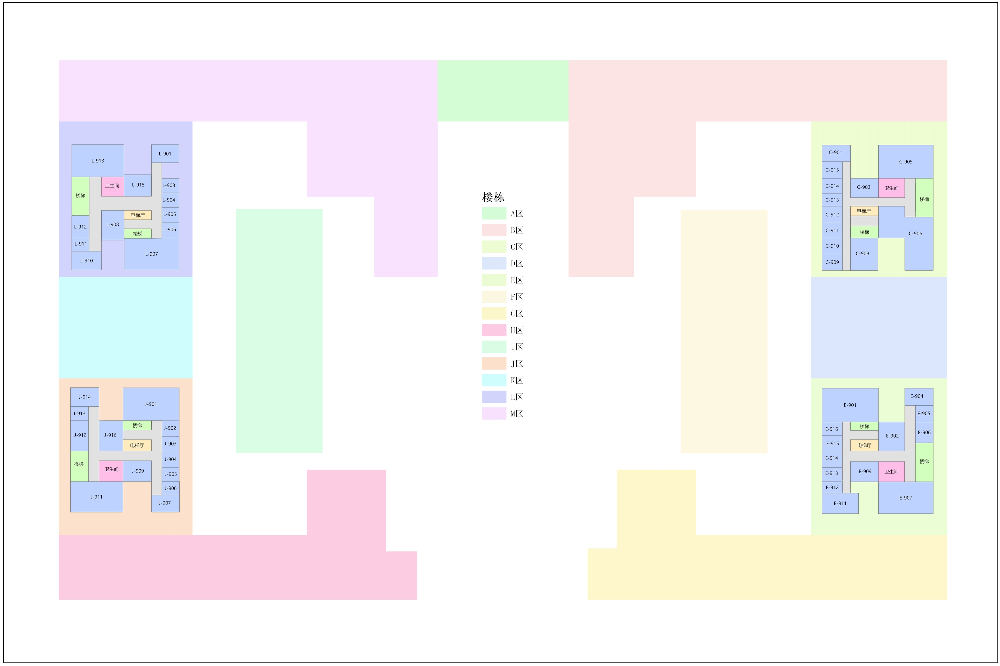
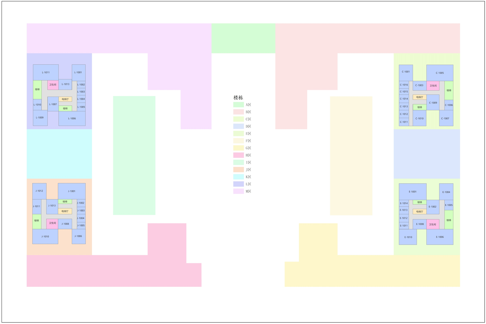

# 楼层数据总览

文萃楼采用 U 形布局，低楼层（1F–2F）包含全部 13 个分区及圆楼，中间楼层（3F–7F）不含裙房 G/H 区，高楼层（8F–10F）仅保留四座角楼（L/J/C/E）。

每层平面图均采用颜色编码标注各分区，房间按 `{分区}-{楼层}{序号}` 格式命名。详细的分区架构说明请参见[楼栋分区架构](zones.md)。

---

## 1F — 入口层

!!! abstract "1F 速览"
    - **活跃分区**：全部 13 区（A–M）+ 圆楼
    - **房间数**：约 130 间
    - **特殊设施**：门厅×2、多处入口、圆楼报告厅、H/G 区休息区
    - **垂直交通**：楼梯×8+、电梯厅×4

=== "官方平面图"
    { width="100%" }

    *来源：文萃楼官方 3D 导航平台*

=== "拓扑示意图"
    { width="80%" }

    *简化拓扑模型（仅供参考）*

=== "房间数据"

    | 分区 | 房间编号范围 | 房间数 | 备注 |
    |------|-----------|--------|------|
    | L 区 | L-101 ~ L-122 | ~22 | 含楼梯×2、电梯厅、卫生间 |
    | J 区 | J-101 ~ J-122 | ~22 | 含楼梯×2、电梯厅、卫生间 |
    | E 区 | E-101 ~ E-122 | ~22 | 含楼梯×2、电梯厅、卫生间 |
    | C 区 | C-101 ~ C-109 | ~9 | 含楼梯×2、电梯厅 |
    | B 区 | B-128 ~ B-140 | ~13 | 含楼梯×2、电梯厅 |
    | M 区 | M-123 ~ M-135 | ~8 | 含楼梯、电梯厅、卫生间 |
    | I 区 | I-101 ~ I-104 | 4 | 含楼梯 |
    | F 区 | F-101 ~ F-104 | 4 | 含楼梯、电梯厅、卫生间 |
    | K 区 | — | — | 通道/走廊区域 |
    | H 区 | H-123 ~ H-130 | ~8 | 含 1F 休息区、楼梯 |
    | G 区 | G-123 ~ G-130 | ~8 | 含 1F 休息区、楼梯 |
    | 圆楼 | — | — | 报告厅 |

    **公共设施**：门厅×2（左翼/右翼）、多处入口

---

## 2F — 大型教学区

!!! abstract "2F 速览"
    - **活跃分区**：全部 13 区（A–M）+ 圆楼
    - **房间数**：约 140 间
    - **特点**：各分区均有大量教室，是教学主力楼层
    - **垂直交通**：楼梯×8+、电梯厅×4

=== "官方平面图"
    { width="100%" }

    *来源：文萃楼官方 3D 导航平台*

=== "拓扑示意图"
    { width="80%" }

    *简化拓扑模型（仅供参考）*

=== "房间数据"

    | 分区 | 房间编号范围 | 房间数 | 备注 |
    |------|-----------|--------|------|
    | L 区 | L-201 ~ L-219, L-2102 | ~20 | 含楼梯×2、电梯厅、卫生间 |
    | J 区 | J-201 ~ J-219 | ~19 | 含楼梯×2、电梯厅、卫生间 |
    | E 区 | E-201 ~ E-219 | ~19 | 含楼梯×2、电梯厅、卫生间 |
    | C 区 | C-201 ~ C-208 | ~8 | 含楼梯×2、电梯厅、卫生间 |
    | B 区 | B-221 ~ B-233 | ~13 | 含楼梯×2、电梯厅 |
    | M 区 | M-221 ~ M-233 | ~9 | 含楼梯、电梯厅、卫生间 |
    | I 区 | I-201 ~ I-208 | 8 | 含楼梯 |
    | F 区 | F-201 ~ F-208 | 8 | 含楼梯、电梯厅 |
    | K 区 | — | — | 通道/走廊区域 |
    | H 区 | H-221 ~ H-233 | ~9 | 含楼梯 |
    | G 区 | G-221 ~ G-233 | ~13 | 含楼梯 |
    | 圆楼 | — | — | 圆楼 |

---

## 3F — 教学/科研层

!!! abstract "3F 速览"
    - **活跃分区**：11 区（无 G/H 裙房）+ 圆形教室
    - **房间数**：约 150 间
    - **特点**：A 区出现大量房间（40+ 间），D 区开始出现
    - **垂直交通**：楼梯×8+、电梯厅×4+

=== "官方平面图"
    { width="100%" }

    *来源：文萃楼官方 3D 导航平台*

=== "拓扑示意图"
    { width="80%" }

    *简化拓扑模型（仅供参考）*

=== "房间数据"

    | 分区 | 房间编号范围 | 房间数 | 备注 |
    |------|-----------|--------|------|
    | A 区 | A-301 ~ A-342 | ~42 | 两排密集布局，含楼梯、电梯厅、卫生间 |
    | L 区 | L-301 ~ L-319 | ~19 | 含楼梯×2、电梯厅、卫生间 |
    | J 区 | J-301 ~ J-320 | ~20 | 含楼梯×2、电梯厅、卫生间 |
    | E 区 | E-301 ~ E-320 | ~20 | 含楼梯×2、电梯厅、卫生间 |
    | C 区 | C-301 ~ C-306 | ~6 | 含楼梯×2、电梯厅、卫生间 |
    | K 区 | K-301 ~ K-309 | ~9 | |
    | I 区 | I-301 ~ I-308 | 8 | 含楼梯 |
    | F 区 | F-301 ~ F-308 | 8 | 含楼梯、电梯厅、卫生间 |
    | M 区 | — | — | 通道区域 |
    | D 区 | D-301 ~ D-309 | ~9 | |
    | 圆楼 | — | — | 圆形教室 |

---

## 4F — 教学/科研层

!!! abstract "4F 速览"
    - **活跃分区**：11 区（无 G/H 裙房）+ 圆形教室
    - **房间数**：约 150 间
    - **特点**：A 区 40+ 间，各区均有研究室/实验室

=== "官方平面图"
    { width="100%" }

    *来源：文萃楼官方 3D 导航平台*

=== "拓扑示意图"
    { width="80%" }

    *简化拓扑模型（仅供参考）*

=== "房间数据"

    | 分区 | 房间编号范围 | 房间数 | 备注 |
    |------|-----------|--------|------|
    | A 区 | A-401 ~ A-442 | ~42 | 两排密集布局 |
    | L 区 | L-401 ~ L-416 | ~16 | 含楼梯×2、电梯厅、卫生间 |
    | J 区 | J-401 ~ J-417 | ~17 | 含楼梯×2、电梯厅、卫生间 |
    | E 区 | E-401 ~ E-417 | ~17 | 含楼梯×2、电梯厅、卫生间 |
    | C 区 | C-404 ~ C-409 | ~6 | 含楼梯×2、电梯厅、卫生间 |
    | K 区 | K-401 ~ K-411 | ~11 | |
    | I 区 | I-401 ~ I-408 | 8 | 含楼梯 |
    | F 区 | F-401 ~ F-407 | 7 | 含楼梯、电梯厅、卫生间 |
    | M 区 | — | — | 通道区域 |
    | D 区 | D-401 ~ D-411 | ~11 | |
    | 圆楼 | — | — | 圆形教室 |

---

## 5F — 教学/科研层

!!! abstract "5F 速览"
    - **活跃分区**：11 区（无 G/H 裙房）+ 圆形教室
    - **房间数**：约 150 间
    - **特点**：结构与 3F/4F 类似，A 区 40+ 间

=== "官方平面图"
    { width="100%" }

    *来源：文萃楼官方 3D 导航平台*

=== "拓扑示意图"
    { width="80%" }

    *简化拓扑模型（仅供参考）*

=== "房间数据"

    | 分区 | 房间编号范围 | 房间数 | 备注 |
    |------|-----------|--------|------|
    | A 区 | A-501 ~ A-542 | ~42 | 两排密集布局 |
    | L 区 | L-501 ~ L-518 | ~18 | 含楼梯×2、电梯厅、卫生间 |
    | J 区 | J-501 ~ J-519 | ~19 | 含楼梯×2、电梯厅、卫生间 |
    | E 区 | E-501 ~ E-519 | ~19 | 含楼梯×2、电梯厅、卫生间 |
    | C 区 | C-503 ~ C-508 | ~6 | 含楼梯×2、电梯厅、卫生间 |
    | K 区 | K-501 ~ K-511 | ~11 | |
    | I 区 | I-501 ~ I-508 | 8 | 含楼梯 |
    | F 区 | F-501 ~ F-508 | 8 | 含楼梯、电梯厅、卫生间 |
    | M 区 | — | — | 通道区域 |
    | D 区 | D-501 ~ D-511 | ~11 | |
    | 圆楼 | — | — | 圆形教室 |

---

## 6F — 教学/科研层

!!! abstract "6F 速览"
    - **活跃分区**：11 区（无 G/H 裙房）+ 圆形教室
    - **房间数**：约 155 间
    - **特点**：C 区房间数增加至 15 间

=== "官方平面图"
    { width="100%" }

    *来源：文萃楼官方 3D 导航平台*

=== "拓扑示意图"
    { width="80%" }

    *简化拓扑模型（仅供参考）*

=== "房间数据"

    | 分区 | 房间编号范围 | 房间数 | 备注 |
    |------|-----------|--------|------|
    | A 区 | A-601 ~ A-642 | ~42 | 两排密集布局 |
    | L 区 | L-601 ~ L-616 | ~16 | 含楼梯×2、电梯厅、卫生间 |
    | J 区 | J-601 ~ J-617 | ~17 | 含楼梯×2、电梯厅、卫生间 |
    | E 区 | E-601 ~ E-617 | ~17 | 含楼梯×2、电梯厅、卫生间 |
    | C 区 | C-601 ~ C-615 | ~15 | 含楼梯×2、电梯厅、卫生间 |
    | K 区 | K-601 ~ K-611 | ~11 | |
    | I 区 | I-601 ~ I-608 | 8 | 含楼梯 |
    | F 区 | F-601 ~ F-608 | 8 | 含楼梯、电梯厅、卫生间 |
    | M 区 | — | — | 通道区域 |
    | D 区 | D-601 ~ D-611 | ~11 | |
    | 圆楼 | — | — | 圆形教室 |

---

## 7F — 教学/科研层（中高层最高）

!!! abstract "7F 速览"
    - **活跃分区**：11 区（无 G/H 裙房）+ 圆形教室
    - **房间数**：约 160 间
    - **特点**：主楼与连接区的最高楼层，C 区房间数达 16 间

=== "官方平面图"
    { width="100%" }

    *来源：文萃楼官方 3D 导航平台*

=== "拓扑示意图"
    { width="80%" }

    *简化拓扑模型（仅供参考）*

=== "房间数据"

    | 分区 | 房间编号范围 | 房间数 | 备注 |
    |------|-----------|--------|------|
    | A 区 | A-701 ~ A-742 | ~42 | 两排密集布局 |
    | L 区 | L-701 ~ L-718 | ~18 | 含楼梯×2、电梯厅、卫生间 |
    | J 区 | J-701 ~ J-719 | ~19 | 含楼梯×2、电梯厅、卫生间 |
    | E 区 | E-701 ~ E-719 | ~19 | 含楼梯×2、电梯厅、卫生间 |
    | C 区 | C-701 ~ C-716 | ~16 | 含楼梯×2、电梯厅、卫生间 |
    | K 区 | K-701 ~ K-711 | ~11 | |
    | I 区 | I-701 ~ I-708 | 8 | 含楼梯 |
    | F 区 | F-701 ~ F-708 | 8 | 含楼梯、电梯厅、卫生间 |
    | M 区 | — | — | 通道区域 |
    | D 区 | D-701 ~ D-711 | ~11 | |
    | 圆楼 | — | — | 圆形教室 |

---

## 8F — 角楼科研层

!!! abstract "8F 速览"
    - **活跃分区**：仅 4 座角楼（L/J/C/E）
    - **房间数**：约 58 间
    - **特点**：主楼及连接区在此层以上不存在，仅角楼延伸

=== "官方平面图"
    { width="100%" }

    *来源：文萃楼官方 3D 导航平台*

=== "拓扑示意图"
    { width="80%" }

    *简化拓扑模型（仅供参考）*

=== "房间数据"

    | 分区 | 房间编号范围 | 房间数 | 备注 |
    |------|-----------|--------|------|
    | L 区 | L-801 ~ L-814 | ~14 | 含楼梯×2、电梯厅、卫生间 |
    | J 区 | J-801 ~ J-815 | ~15 | 含楼梯×2、电梯厅、卫生间 |
    | C 区 | C-801 ~ C-814 | ~14 | 含楼梯×2、电梯厅、卫生间 |
    | E 区 | E-801 ~ E-815 | ~15 | 含楼梯×2、电梯厅、卫生间 |

---

## 9F — 角楼科研层

!!! abstract "9F 速览"
    - **活跃分区**：仅 4 座角楼（L/J/C/E）
    - **房间数**：约 62 间
    - **特点**：角楼高层，各区房间略多于 8F

=== "官方平面图"
    { width="100%" }

    *来源：文萃楼官方 3D 导航平台*

=== "拓扑示意图"
    { width="80%" }

    *简化拓扑模型（仅供参考）*

=== "房间数据"

    | 分区 | 房间编号范围 | 房间数 | 备注 |
    |------|-----------|--------|------|
    | L 区 | L-901 ~ L-915 | ~15 | 含楼梯×2、电梯厅、卫生间 |
    | J 区 | J-901 ~ J-916 | ~16 | 含楼梯×2、电梯厅、卫生间 |
    | C 区 | C-901 ~ C-915 | ~15 | 含楼梯×2、电梯厅、卫生间 |
    | E 区 | E-901 ~ E-916 | ~16 | 含楼梯×2、电梯厅、卫生间 |

---

## 10F — 最高层

!!! abstract "10F 速览"
    - **活跃分区**：仅 4 座角楼（L/J/C/E）
    - **房间数**：约 56 间
    - **特点**：建筑最高层，各角楼均到达此层

=== "官方平面图"
    { width="100%" }

    *来源：文萃楼官方 3D 导航平台*

=== "拓扑示意图"
    { width="80%" }

    *简化拓扑模型（仅供参考）*

=== "房间数据"

    | 分区 | 房间编号范围 | 房间数 | 备注 |
    |------|-----------|--------|------|
    | L 区 | L-1001 ~ L-1013 | ~13 | 含楼梯×2、电梯厅、卫生间 |
    | J 区 | J-1001 ~ J-1013 | ~13 | 含楼梯×2、电梯厅、卫生间 |
    | C 区 | C-1001 ~ C-1016 | ~16 | 含楼梯×2、电梯厅、卫生间 |
    | E 区 | E-1001 ~ E-1014 | ~14 | 含楼梯×2、电梯厅、卫生间 |

---

## 跨层连接

文萃楼的垂直交通按区域分布，四座角楼各自拥有独立的全高垂直交通系统：

| 角楼 | 楼梯 | 电梯厅 | 覆盖楼层 |
|------|------|--------|---------|
| L 区（西北） | 2 部 | 1 处 | 1F–10F |
| J 区（西南） | 2 部 | 1 处 | 1F–10F |
| C 区（东北） | 2 部 | 1 处 | 1F–10F |
| E 区（东南） | 2 部 | 1 处 | 1F–10F |

此外，主楼 A 区（3F–7F）和连接区 I/M/F 均设有额外楼梯和电梯厅，保证中间楼层的垂直可达性。
