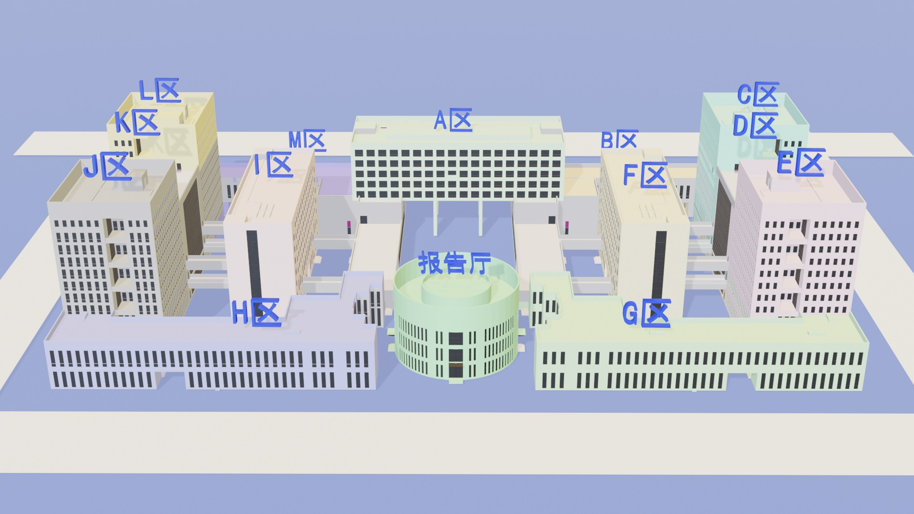
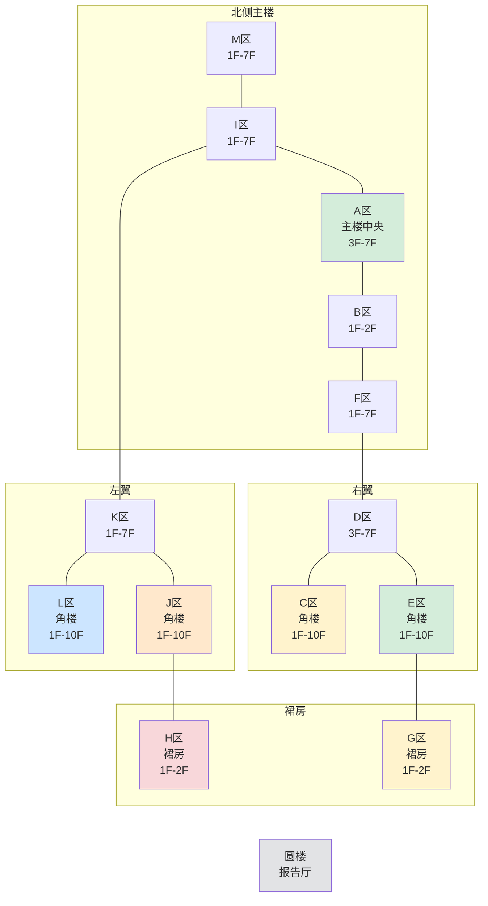

# 楼栋分区架构

文萃楼并非单体建筑，而是由 **13 个分区（A–M）** 和一座 **圆楼（报告厅）** 组成的 U 形楼宇群。各分区通过走廊贯通连接，但在高度、功能和垂直交通上各自独立。

!!! tip "数据来源"
    本页数据基于文萃楼官方 3D 导航平台的楼层平面图分析。
    平台地址：`https://wencuigis.info.bit.edu.cn/3dbuilding/#/building2`

## 3D 总览

<figure markdown="span">
  { width="100%" }
  <figcaption>文萃楼 3D 总览 — 13 个分区（A–M）构成 U 形楼宇群，中央为圆形报告厅（来源：官方 3D 导航平台）</figcaption>
</figure>

## U 形空间布局



## 分区分类

### 角楼（1F–10F）

四座角楼是建筑最高的部分，各含独立的楼梯、电梯厅和卫生间。

| 分区 | 位置 | 楼层范围 | 典型每层房间数 | 设施 |
|------|------|---------|------------|------|
| **L 区** | 左翼上方（西北角楼） | 1F–10F | 13–22 间 | 楼梯×2、电梯厅、卫生间 |
| **J 区** | 左翼下方（西南角楼） | 1F–10F | 13–22 间 | 楼梯×2、电梯厅、卫生间 |
| **C 区** | 右翼上方（东北角楼） | 1F–10F | 6–16 间 | 楼梯×2、电梯厅、卫生间 |
| **E 区** | 右翼下方（东南角楼） | 1F–10F | 14–22 间 | 楼梯×2、电梯厅、卫生间 |

### 主楼与连接区（1F–7F）

主楼和连接区构成 U 形的主体结构，在 8F 以上不存在。

| 分区 | 位置 | 楼层范围 | 典型每层房间数 | 说明 |
|------|------|---------|------------|------|
| **A 区** | 北侧主楼中央 | 3F–7F | 40+ 间 | 房间最多的分区，两排密集布局 |
| **B 区** | 北侧主楼东段 | 1F–2F | 13 间 | 低楼层大型教室区 |
| **M 区** | 北侧主楼西段 | 1F–7F | 8–9 间 | 连接 I 区和主楼 |
| **I 区** | 左翼上段连接 | 1F–7F | 4–8 间 | 连接主楼与左翼角楼 |
| **K 区** | 左翼中段 | 1F–7F | 6–11 间 | 连接 L 区和 J 区 |
| **F 区** | 右翼上段连接 | 1F–7F | 4–8 间 | 连接主楼与右翼角楼 |
| **D 区** | 右翼中段 | 3F–7F | 9–11 间 | 连接 C 区和 E 区 |

### 裙房（1F–2F）

裙房仅有两层，位于 U 形底部两侧。

| 分区 | 位置 | 楼层范围 | 典型每层房间数 | 说明 |
|------|------|---------|------------|------|
| **H 区** | 左翼底部（西南裙房） | 1F–2F | 8–9 间 | 含 1F 休息区 |
| **G 区** | 右翼底部（东南裙房） | 1F–2F | 8–13 间 | 含 1F 休息区 |

### 圆楼

| 位置 | 楼层 | 功能 |
|------|------|------|
| U 形中央 | 1F–2F | 报告厅 / 圆形教室 |

## 房间命名规则

文萃楼的房间采用统一的编号规则：

```
{分区}-{楼层号}{序号}
```

| 组成部分 | 说明 | 示例 |
|---------|------|------|
| 分区 | A–M 单字母 | `L`, `A`, `E` |
| 楼层号 | 1–10 | `4`, `10` |
| 序号 | 两位或三位数字 | `01`, `16`, `102` |

**示例**：

- `A-405` → A 区 4 楼第 05 号房间
- `L-201` → L 区 2 楼第 01 号房间
- `J-913` → J 区 9 楼第 13 号房间
- `E-1014` → E 区 10 楼第 14 号房间
- `C-1001` → C 区 10 楼第 01 号房间

## 垂直交通

每个角楼区（L、J、C、E）拥有完整独立的垂直交通系统：

| 设施 | L 区 | J 区 | C 区 | E 区 |
|------|------|------|------|------|
| 楼梯 | 2 部 (1F–10F) | 2 部 (1F–10F) | 2 部 (1F–10F) | 2 部 (1F–10F) |
| 电梯厅 | 1 处 (1F–10F) | 1 处 (1F–10F) | 1 处 (1F–10F) | 1 处 (1F–10F) |
| 卫生间 | 每层 1 处 | 每层 1 处 | 每层 1 处 | 每层 1 处 |

主楼和连接区在 3F–7F 通过 A 区走廊贯通，设有额外的楼梯和电梯厅。
