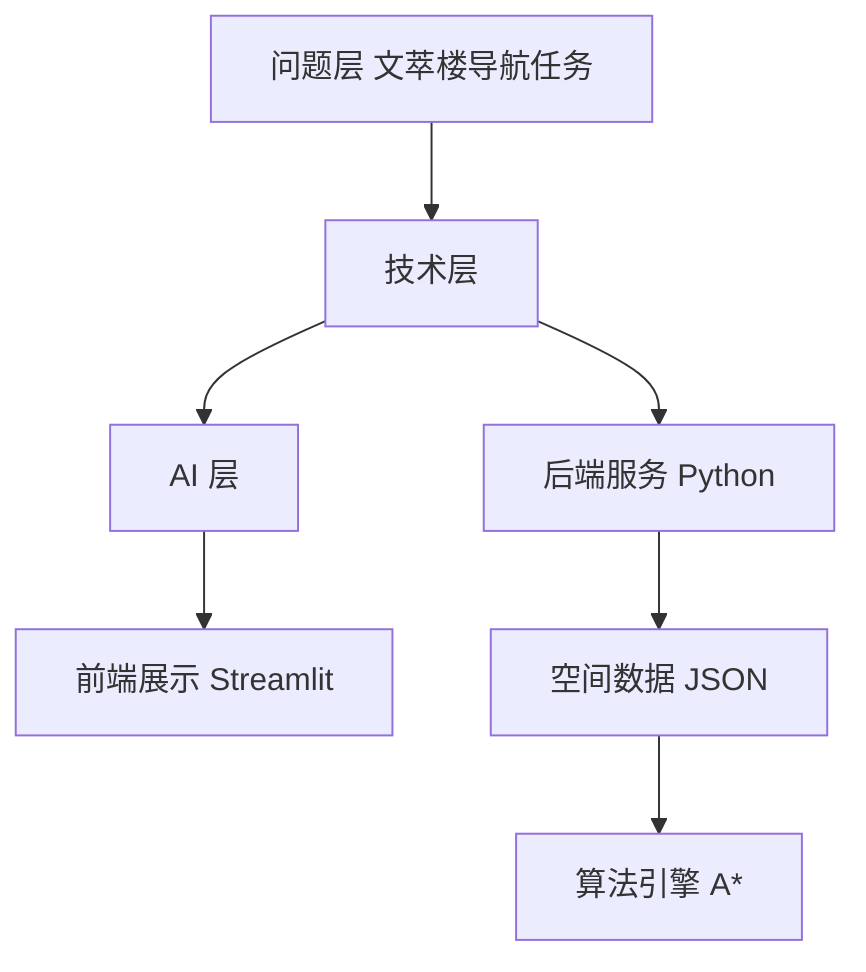

# 技术实现指南

本指南面向文萃楼具身导航系统项目，系统阐述从空间建模、语义映射、路径规划到交互展示的完整技术实现路径。

## 实现路径

## 核心模块

| 模块 | 功能 | 文档 |
|------|------|------|
| 空间建模 | 构建楼层拓扑图 | [空间建模模块](spatial.md) |
| 语义映射 | 自然语言到节点映射 | [语义映射模块](semantic.md) |
| 路径规划 | A* 最短路径搜索 | [路径规划模块](pathfinding.md) |
| 交互展示 | 可视化与用户交互 | [交互展示模块](interaction.md) |

## 技术底座

- **语言与算法**：Python，便于与 AI 协作与快速原型
- **图算法**：NetworkX/自定义 A*，适合构建与操作拓扑图
- **前端**：Streamlit，降低开发成本，提升演示效果
- **数据存储**：JSON 拓扑图，简单高效

## 版本迭代路线

| 版本 | 特性 |
|------|------|
| V1 教学演示版 | 手动选起点、输入终点、输出路径图+文字 |
| V2 现场测试版 | 增加扫码定位、楼层切换 |
| V3 AI 增强版 | 自然语言输入、AI 问答解释 |
| V4 轻量定位 | 二维码起点定位、IMU 步行更新 |
| V5 数字孪生/仿真 | Unity 接入、3D 漫游导航 |
