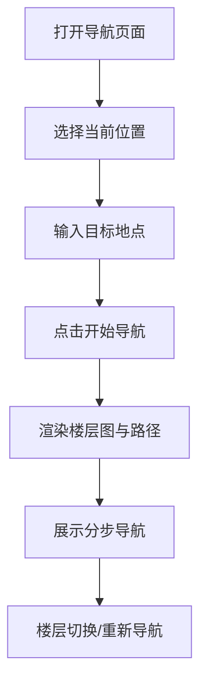

# 交互展示模块

## 概述

交互展示模块基于 Streamlit 构建，提供"起点选择—目标输入—路径展示—分步导航"的完整交互流程。

## 页面结构



## 核心功能

### 1. 起点选择

- 从楼层和房间列表中选择当前位置
- 支持按楼层筛选节点

### 2. 目标输入

- 支持房间号输入（如"D402"）
- 支持语义描述输入（如"教务办公室"）

### 3. 路径可视化

- 在楼层平面图上高亮显示路径
- 多楼层路径按楼层分段显示
- 标注起点和终点位置

### 4. 分步导航

- 自然语言导航指令
- 楼层切换提示（楼梯/电梯标识）

## 技术实现

### Streamlit 布局

```
┌──────────────────────────────────┐
│          文萃楼智能导航           │
├─────────────┬────────────────────┤
│   导航路径  │    分步导航指令    │
│  (楼层图)   │  1. 从xx出发...   │
│             │  2. 沿走廊前行... │
│             │  3. 上楼至4层...  │
│             │  4. 到达D402      │
├─────────────┴────────────────────┤
│        楼层切换过渡提示          │
└──────────────────────────────────┘
```

### 多楼层显示

对于跨楼层路径，系统按楼层分段渲染：

1. 每个楼层段显示对应的平面图
2. 路径高亮标注在该楼层的路径段
3. 楼层间显示过渡提示（楼梯/电梯图标）

## 楼层平面图

系统使用预生成的楼层平面图（PNG），显示：

- 房间布局和编号
- 走廊、楼梯、电梯位置
- A/B 区域划分


