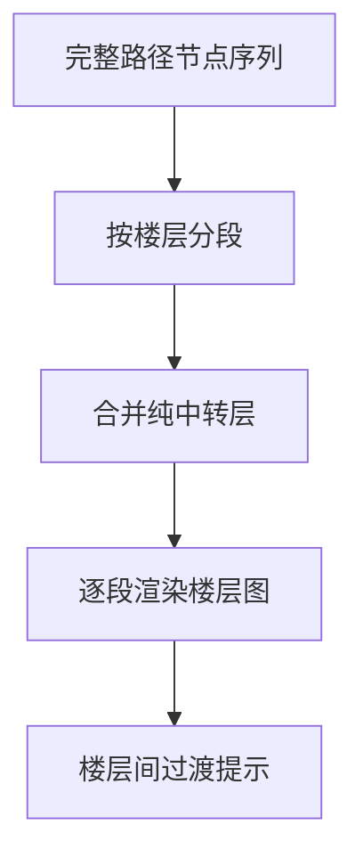

# 路径规划模块

## 概述

路径规划模块在楼宇拓扑图上执行 A* 搜索，找到从起点到终点的最短路径。

## 算法实现

### A* 算法

A* 算法使用启发式函数加速搜索：

- **g(n)**：从起点到当前节点的实际代价
- **h(n)**：从当前节点到终点的估计代价（启发式）
- **f(n) = g(n) + h(n)**：总估计代价

### 启发式函数

使用欧几里得距离作为启发式函数，加上楼层惩罚：

```
h(n) = sqrt((x1-x2)^2 + (y1-y2)^2) + floor_penalty
```

其中 `floor_penalty` 考虑楼层差异带来的额外代价。

## 权重设计

| 边类型 | 权重 | 说明 |
|--------|------|------|
| 同层走廊连接 | 1.0 | 标准行走 |
| 房间-走廊连接 | 1.0 | 进出房间 |
| 楼梯跨层 | 3.0 | 楼梯换层 |
| 电梯跨层 | 2.0 | 电梯更便捷 |

## 多楼层路径处理

### 路径分段



### 中转层合并

当路径经过某楼层但只途经楼梯/电梯节点时，该楼层被视为"纯中转层"并合并到前一段，避免显示无用的楼层段。

## 实现文件

- `src/navigation.py`：图数据结构和 A* 算法实现
- `app.py`：路径分段和可视化渲染

## 导航输出

路径规划的输出包括：

1. **节点序列**：路径上经过的所有节点 ID
2. **总代价**：路径的总权重
3. **分步导航**：自然语言描述的分步指令
4. **楼层分段**：按楼层分段的路径信息
