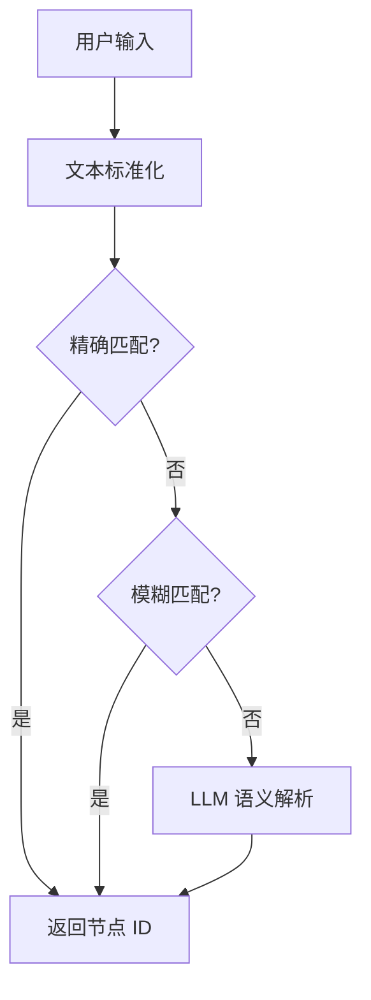

# 语义映射模块

## 概述

语义映射模块将用户的自然语言输入转化为系统可识别的目标节点 ID。

## 映射策略

采用"规则为主 + LLM 增强"的混合方案：

- **规则匹配**：稳定、简单、适合首版
- **LLM 辅助**：更智能、更符合 AI 教学主题

## 映射数据

映射数据存储在 `data/semantic_mapping.json` 中，包含以下类别：

### 目标词典

将常见表达映射到目标房间：

| 输入表达 | 目标节点 | 楼层 |
|---------|---------|------|
| D402 | D402 | 4F |
| 教务办公室 | D402 | 4F |
| 机房 | A701 | 7F |
| 计算机机房 | A701 | 7F |
| 生物实验室 | A301 | 3F |
| 服务中心 | B101 | 1F |
| 自习室 | B801 | 8F |
| 报告厅 | A1002 | 10F |

### 位置关键词

| 关键词 | 映射规则 |
|--------|---------|
| A 电梯 | elevator_A_{当前楼层} |
| B 楼梯 | stairs_B_{当前楼层} |
| A 走廊 | corridor_{当前楼层}_A |

### 楼层描述

每个楼层有简短的功能描述，用于帮助用户理解各楼层定位。

## 实现代码

语义映射在 `src/semantic_mapper.py` 中实现，主要功能：

1. 加载映射字典
2. 精确匹配查询
3. 模糊匹配（基于字符串相似度）
4. 返回目标节点 ID 和所在楼层
