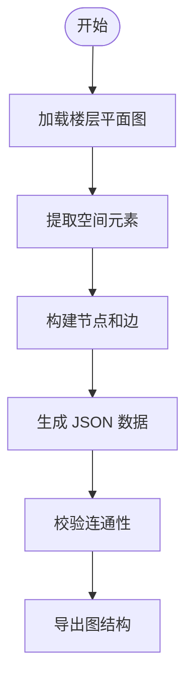

# 空间建模模块

## 概述

空间建模是整个导航系统的基础，将文萃楼的物理空间转化为机器可计算的图结构。

## 数据源

官方 3D 平台提供的 1-10 层平面图，从中提取：

- 房间位置和功能
- 走廊布局和连接
- 楼梯和电梯位置
- 出入口位置

## 建模流程



## 数据格式

### 建筑数据 (wencui_building.json)

```json
{
  "building_name": "文萃楼",
  "coordinate_space": {"width": 200, "height": 200},
  "floors": [
    {
      "floor": "1F",
      "description": "一层 - 大厅/入口",
      "nodes": [
        {"id": "corridor_1F_main", "type": "corridor", "x": 100, "y": 100, "name": "1F主走廊"},
        {"id": "stairs_A_1F", "type": "stairs", "x": 30, "y": 100, "name": "A楼梯(1F)"},
        {"id": "A101", "type": "room", "x": 40, "y": 130, "name": "教室101"}
      ],
      "edges": [
        ["corridor_1F_main", "corridor_1F_A"],
        ["corridor_1F_A", "stairs_A_1F"],
        ["corridor_1F_A", "A101"]
      ]
    }
  ],
  "cross_floor_edges": [
    {"from": "stairs_A_1F", "to": "stairs_A_2F", "type": "stairs"},
    {"from": "elevator_A_1F", "to": "elevator_A_2F", "type": "elevator"}
  ]
}
```

## 楼层结构

每层标准布局包含：

| 节点 | 坐标 | 类型 |
|------|------|------|
| 主走廊 | (100, 100) | corridor |
| A 走廊 | (50, 100) | corridor |
| B 走廊 | (150, 100) | corridor |
| 楼梯 A | (30, 100) | stairs |
| 楼梯 B | (170, 100) | stairs |
| 电梯 A | (50, 60) | elevator |
| 电梯 B | (150, 60) | elevator |
| A 区房间 | (40-50, 130-140) | room |
| B 区房间 | (150-160, 130-140) | room |

## 跨层连接

4 条垂直交通链，每条 9 条边（1F-2F, 2F-3F, ..., 9F-10F），共 36 条跨层边。
