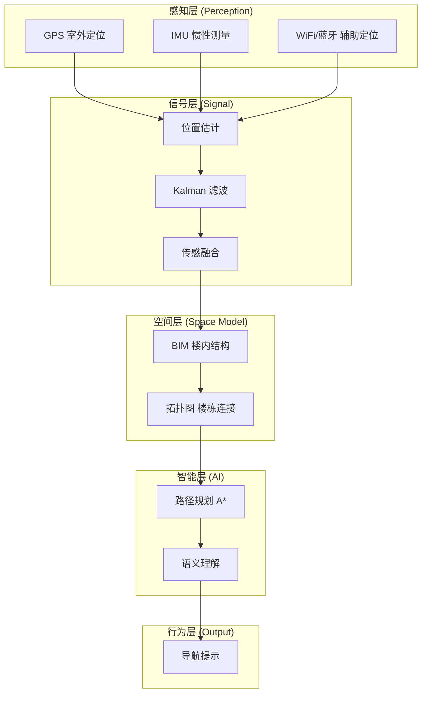

# BIT-Nav-2026 文萃楼智能导航系统

<h2>面向复杂楼宇群的室内外一体化具身导航系统</h2>

北京理工大学良乡校区 | 智能信号处理课程项目

---

## 项目简介

文萃楼具身导航项目是以北京理工大学良乡校区文萃楼为真实载体，构建的"最小可讲清具身智能系统"的创新实践项目。该项目融合感知、信号处理、空间建模与智能决策，构建室内外一体化智能导航原型系统。

!!! tip "核心理念"
    从"位置计算"到"行为引导"的跨层跃迁 —— **E = (Geometry, Topology, Semantics)**

## 快速导航

-   :material-eye-outline: **项目概述**

    ---

    了解项目背景、定位、核心价值与创新特色

    [:octicons-arrow-right-24: 查看详情](overview/index.md)

-   :material-layers-outline: **系统架构设计**

    ---

    五层系统架构、三层空间模型与技术实现方案

    [:octicons-arrow-right-24: 查看详情](architecture/index.md)

-   :material-code-braces: **技术实现指南**

    ---

    空间建模、语义映射、路径规划与交互展示的实现细节

    [:octicons-arrow-right-24: 查看详情](implementation/index.md)

-   :material-school-outline: **教学设计**

    ---

    四次课教学方案与演示展示设计

    [:octicons-arrow-right-24: 查看详情](teaching/index.md)

-   :material-office-building: **建筑数据**

    ---

    文萃楼 10 层建筑数据与语义映射表

    [:octicons-arrow-right-24: 查看详情](building/index.md)

-   :material-github: **源码仓库**

    ---

    查看项目源代码与最新更新

    [:octicons-arrow-right-24: GitHub](https://github.com/Zebedee2021/BIT-Nav-2026)

## 技术架构

## 三大核心突破

| 传统导航 | 本项目 |
|---------|--------|
| 到楼 :white_check_mark:, 找不到房间 :x: | 到楼 :white_check_mark:, 到楼层 :white_check_mark:, 到房间 :white_check_mark: |
| (x, y) 二维坐标 | (x, y, z) + 拓扑 + 语义 |
| shortest path | 最近楼梯、是否换楼栋、是否可通行 |

## 技术栈

| 模块 | 技术选型 |
|------|---------|
| 算法语言 | Python |
| 图算法 | NetworkX + A* |
| 前端展示 | Streamlit |
| 空间数据 | JSON 拓扑图 |
| 定位方案 | 二维码扫码 |
| 部署 | GitHub Pages (文档) |
