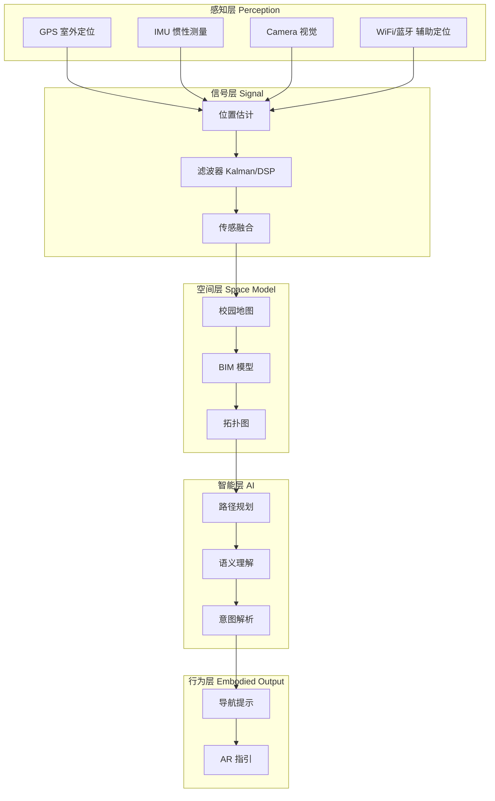
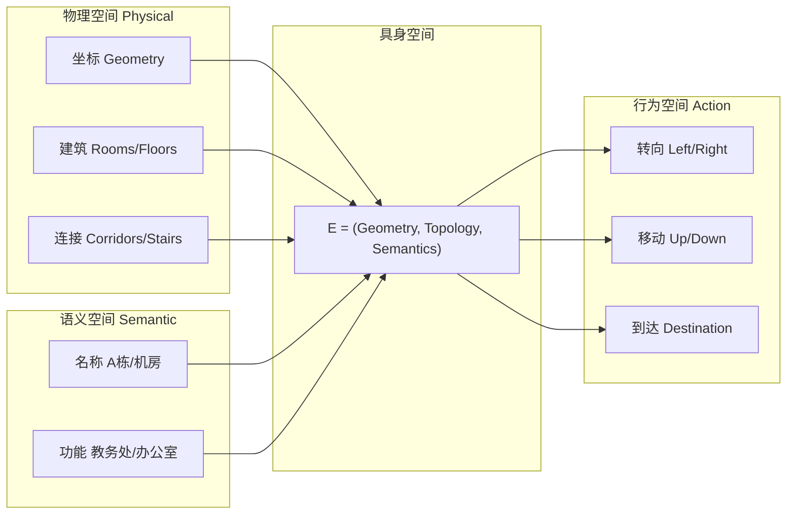
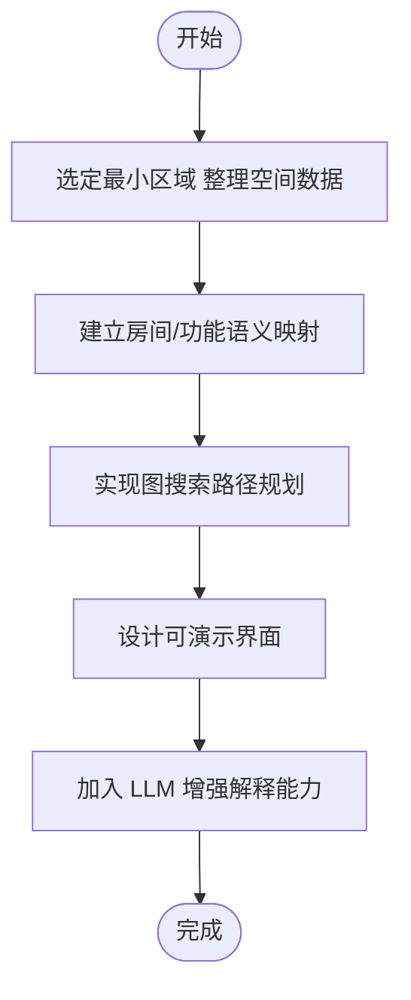
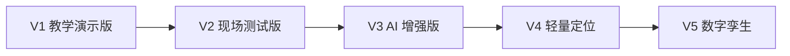

# 系统架构总览

文萃楼具身导航项目采用五层架构设计，每一层都有明确的功能职责和技术实现。

## 五层系统架构

## 三层空间模型

项目采用了统一的具身空间概念，将物理空间、语义空间和行为空间有机整合：

## 数学表达

具身空间采用统一的数学表达形式：

- **E = (Geometry, Topology, Semantics)**
- **Geometry**：房间、坐标等几何信息
- **Topology**：楼栋连接关系等拓扑信息
- **Semantics**：A 栋、教室、办公室等功能语义

## 技术路线

## 版本演进

| 版本 | 功能 |
|------|------|
| V1 | 手动选起点 + 输入终点 + 输出路径图 |
| V2 | 增加扫码定位 + 楼层切换 |
| V3 | 自然语言输入 + AI 问答 |
| V4 | 二维码起点 + IMU 步行更新 |
| V5 | Unity 接入 + 3D 漫游 |
