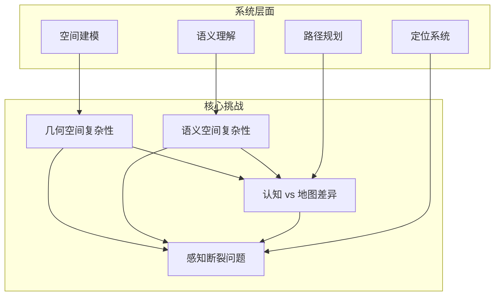

# 核心挑战分析

文萃楼具身导航项目面临着从传统导航系统向具身智能系统转型的核心挑战。这些挑战不仅是技术层面的难题，更是对传统导航理念的根本性突破。

## 四大核心难点

### 1. 几何空间复杂性

**多楼栋拼接问题**

- 文萃楼由多个独立楼栋组成，各楼栋间存在复杂的连接关系
- 不同楼栋的功能定位差异巨大
- 楼栋间的通道、连廊等连接设施需要精确建模

**非规则结构挑战**

- 楼层布局呈现非规则形状
- 走廊、楼梯、电梯等基础设施的空间分布不规则
- 房间编号系统在不同楼栋间存在差异

!!! info "本质问题"
    几何空间复杂性的本质是"三维空间 + 拓扑空间"的双重复杂性。

### 2. 语义空间复杂性

- **多义性表达**：同一功能空间存在多种表达方式
- **命名不一致性**：不同功能区域的命名规则不统一
- **功能映射困难**：用户口语化表达与系统标准化表达的差异

!!! info "本质问题"
    语义空间复杂性的本质是"坐标/名称/功能不一致"的根本矛盾。

### 3. 感知断裂问题

- **室内 GPS 失效**：GPS 信号在室内环境中完全失效
- **多源传感融合挑战**：WiFi、蓝牙、IMU 等传感器的精度差异
- **定位精度要求**：楼内导航需要更高的定位精度

!!! info "本质问题"
    感知断裂问题的本质是"Indoor Localization Gap"。

### 4. 认知 vs 地图差异

| 人类认知路径 | 地图路径 |
|-------------|---------|
| "进门 -> 左转 -> 上楼 -> 找 D 区" | "坐标 -> 坐标" 的线性路径 |
| 基于空间记忆和经验 | 基于几何距离的最优路径 |
| 考虑环境特征和个人偏好 | 忽略环境特征和用户体验 |

!!! info "本质问题"
    认知 vs 地图差异的本质是"认知空间 vs 几何空间不一致"的根本矛盾。

## 挑战间的耦合关系

## 技术解决方案

### 分层化解决策略

**第一层：几何空间建模**
基于官方 3D 平台构建精确的楼层拓扑图，建立多尺度空间表示。

**第二层：语义理解与映射**
建立多义词消歧机制，实现用户输入的语义标准化。

**第三层：认知空间适配**
建立人类行为模式数据库，实现认知路径与几何路径的转换。

**第四层：感知融合与定位**
多传感器数据融合，室内外无缝定位。

### 实现原则

!!! tip "三大实现原则"
    1. **先做"能用"，再做"高级"** —— 不要一开始追求实时定位、多模态大模型
    2. **规则系统打底，AI 负责增强** —— 确保系统稳定可用
    3. **先把空间模型做清楚** —— 这是项目成败的关键
