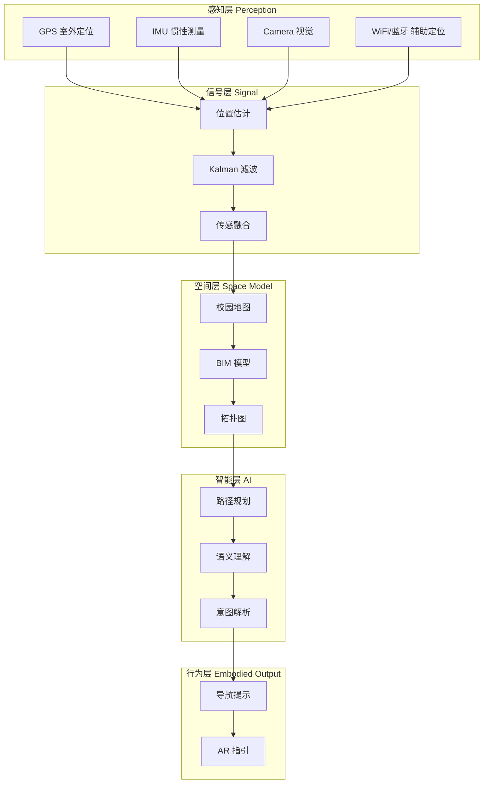
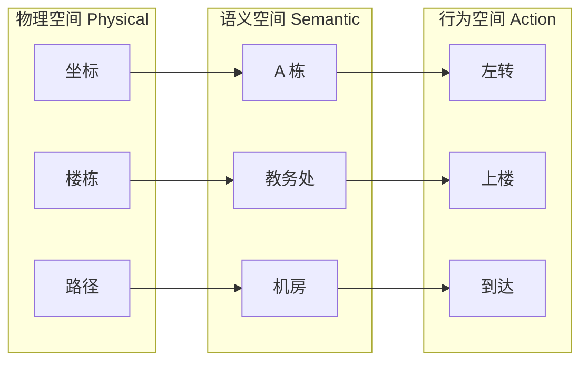
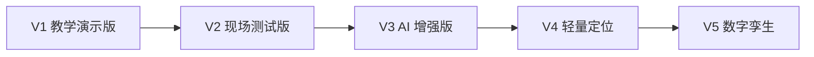

# 项目概述

文萃楼具身导航项目是以北京理工大学良乡校区文萃楼为真实载体，构建的"最小可讲清具身智能系统"的创新实践项目。该项目不是简单的导航应用开发，而是一个融合感知、信号处理、空间建模与智能决策的完整系统闭环。

## 项目背景

文萃楼作为北京理工大学良乡校区的重要组成部分，是一个典型的多楼栋复合教学空间，包含 A/B/C/D/G/H/I/L 等多个楼栋，承担着教学、科研、办公、活动等多重功能。这种复杂的楼宇群结构使得传统的基于坐标的导航方法难以满足精细化定位与人机交互需求。

!!! quote "项目定位"
    **面向复杂楼宇群的室内外一体化具身导航系统** —— 以文萃楼 3D 空间为载体，构建由 AI 参与设计与实现的具身导航系统，贯通信号处理、空间建模与智能决策全过程。

## 核心目标与价值

项目的核心价值在于提供了一个"最小可讲清具身智能系统"的真实场景，通过构建从感知到行为的完整系统闭环，实现从"位置计算"到"行为引导"的跨层跃迁。

### 三大核心突破

1. **解决"最后 10 米问题"**：传统导航到楼即止，本项目实现楼 → 楼层 → 房间的精确引导
2. **空间维度升级**：从 (x, y) 升级为 (x, y, z) + 拓扑 + 语义
3. **具身决策能力**：不仅是最短路径，还考虑最近楼梯、楼栋切换、可通行性

## 项目架构设计

### 五层系统架构

### 三层空间模型

## 技术栈

| 模块 | 推荐实现方式 | 理由 |
|------|-------------|------|
| 定位方案 | 二维码扫码 | 绕过复杂的室内高精度定位 |
| 空间数据 | JSON 拓扑图 | 易于 AI 解析，方便快速构建 |
| 算法语言 | Python | 与 AI 交互最友好 |
| 前端 | Streamlit | 开发成本低，展示效果好 |

## 版本迭代路线

- **V1 教学演示版**：手动选起点 + 输入终点 + 输出路径图
- **V2 现场测试版**：增加扫码定位 + 楼层切换
- **V3 AI 增强版**：自然语言输入 + AI 问答
- **V4 轻量定位**：二维码起点 + IMU 步行更新
- **V5 数字孪生/仿真**：Unity 接入 + 3D 漫游
