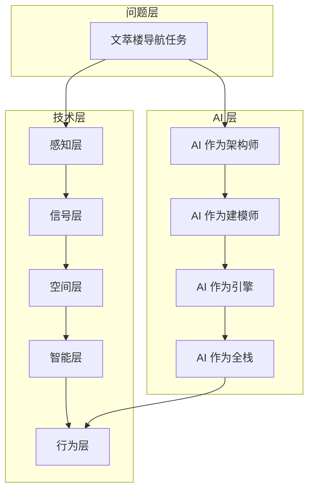
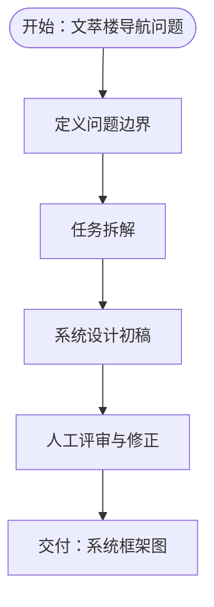
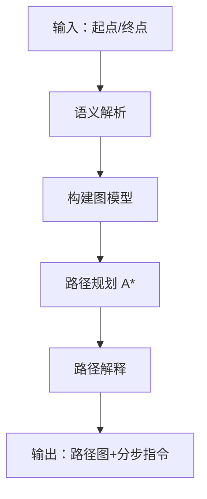
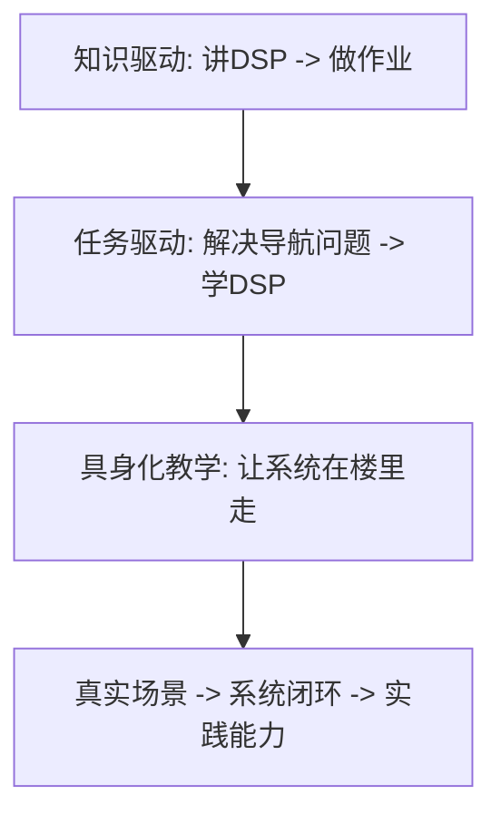

# 教学创新亮点

本教学创新以"文萃楼具身导航项目"为核心载体，围绕三大教学创新点展开：AI 从"工具"变成"参与者"、任务驱动教学模式、具身化教学理念。

## 项目结构

项目以"问题—技术—AI"三层结构为主线，配合四次课的完整项目闭环：

- **问题层**：以文萃楼真实导航任务为载体，将抽象知识转化为可执行问题
- **技术层**：感知 -> 信号 -> 空间 -> 决策 -> 行为的系统闭环
- **AI 层**：贯穿全流程的"参与者"，而非"工具"

## 核心组件

### 组件 A：问题建模（AI 作为架构师）

将文萃楼从"一栋楼"转化为"CPS 系统"，完成系统模块划分与技术路线设计。

### 组件 B：空间建模（AI 作为建模师）

基于官方 3D 平台构建楼层拓扑图，生成可计算图结构。

### 组件 C：路径规划与 AI 决策（AI 作为引擎）

实现图搜索算法与语义解析，输出可执行路径与自然语言指令。

### 组件 D：系统集成与展示（AI 作为全栈）

在 Streamlit 平台完成演示，生成报告与演示脚本。

## 概念总览

## 设计原则

!!! tip "性能考量"
    - **先做"能用"，再做"高级"**：首版不追求实时定位与复杂算法
    - **规则系统打底，AI 负责增强**：避免 AI 不稳定导致系统无法运行
    - **先把空间模型做清楚**：项目成败的关键在于空间建模
