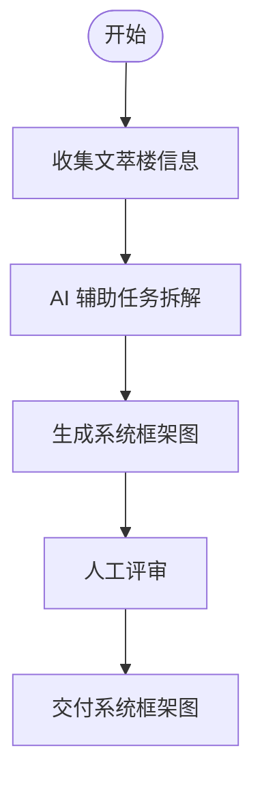
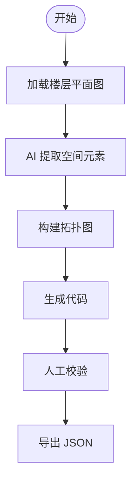
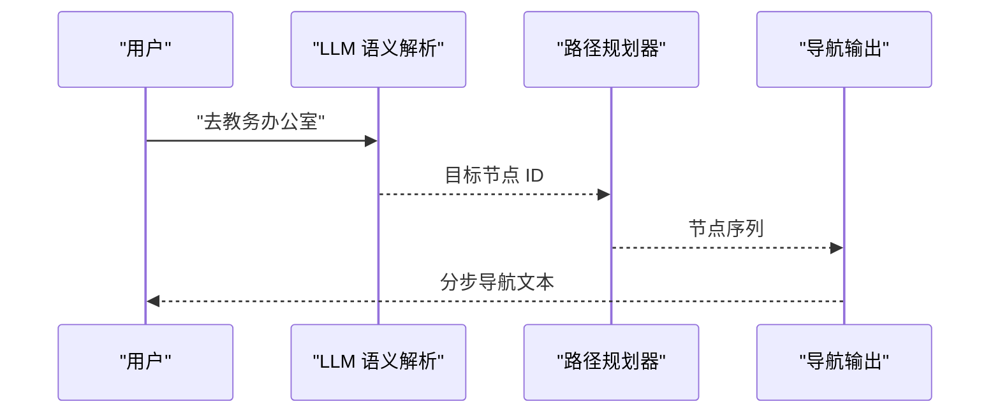
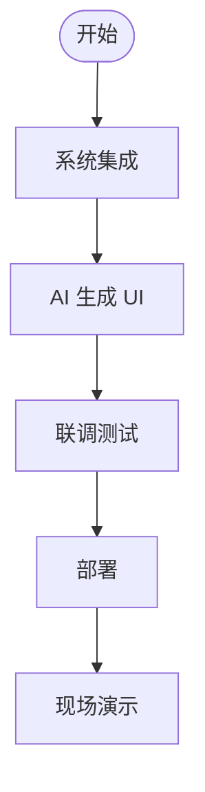

# 四次课教学方案

## 总体目标

构建"可运行的室内外一体化智能导航原型系统"。

## 学生成果要求

1. **导航系统 Demo**：可运行的导航原型系统
2. **系统设计报告**：完整的系统设计方案和实现细节
3. **现场演示**：从 A 点导航到指定房间的演示

---

## 第 1 次课：问题建模（AI as Architect）

### 教学目标

将文萃楼从"一栋楼"转化为"CPS 系统"，理解"导航问题 = 空间建模 + 行为决策"。

### AI 的作用

- 任务拆解：将导航问题分解为"感知—信号—空间—智能—行为"模块
- 系统设计初稿：生成系统框架图

### 学生任务

用 AI 完成：项目需求分析、系统模块划分、初步技术路线

### 产出

一张"系统框架图"（AI + 人工）

### 评估标准

- 框架图是否覆盖五层架构
- 是否体现具身空间 E = (Geometry, Topology, Semantics)

---

## 第 2 次课：空间建模 + 数据理解（AI as Modeler）

### 教学目标

理解"3D 模型 ≠ 图"，"可计算空间"的本质。

### AI 的作用

- 自动解析楼层结构
- 生成拓扑图代码（Python/NetworkX）

### 学生任务

构建：楼层拓扑图、房间连接关系

### 产出

一个"可计算图结构"（JSON 格式）

### 评估标准

- JSON 结构是否包含楼层、节点、边
- 节点类型与连接关系是否合理

---

## 第 3 次课：路径规划 + AI 决策（AI as Engine）

### 教学目标

理解"AI 不是画路线，而是做决策"。

### AI 的作用

- 算法 AI：A* 路径规划
- LLM：用户指令理解、任务转化

### 学生任务

实现：路径规划、语义解析（用 LLM）

### 产出

可运行导航逻辑（Python 模块）

### 评估标准

- 路径规划是否正确
- 语义解析是否准确

---

## 第 4 次课：系统集成 + 展示（AI as Full-stack）

### 教学目标

做一个"真的能用"的系统。

### AI 的作用

- UI 生成（Streamlit）
- 自动生成报告
- 自动生成演示脚本

### 学生任务

完成系统集成与演示

### 产出

完整导航 Demo 演示

### 评估标准

- Demo 能否正常运行
- 导航结果是否清晰可讲解
- 是否包含核心功能
