# 演示与展示

## 演示流程

完整的导航演示流程：

1. 打开导航系统页面
2. 选择当前位置（起点）
3. 输入目标地点（终点）
4. 系统规划路径并展示
5. 按楼层查看导航路径
6. 查看分步导航指令

## 演示场景

### 场景 1：同层导航

- **起点**：1F 大厅
- **终点**：A101 教室
- **预期**：显示 1F 楼层图，高亮路径

### 场景 2：跨层导航

- **起点**：1F 大厅
- **终点**：4F D402
- **预期**：分段显示 1F 和 4F 路径，标注楼梯/电梯过渡

### 场景 3：语义输入导航

- **起点**：1F 大厅
- **输入**："计算机机房"
- **预期**：语义解析为 A701，规划到 7F 的路径

## 展示要点

### 技术展示

- 空间建模：展示 JSON 图结构和 10 层楼层数据
- 语义映射：演示自然语言到节点的映射
- 路径规划：展示 A* 算法的路径搜索过程
- 可视化：多楼层路径分段展示

### 教学展示

- 四次课的教学设计与实施
- AI 参与的各环节展示
- 学生成果与系统 Demo

## 楼层平面图预览

### 建筑总览

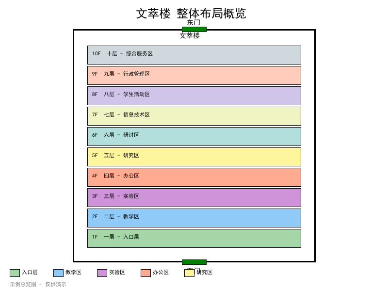

### 各楼层平面图

| 楼层 | 平面图 |
|------|--------|
| 1F | 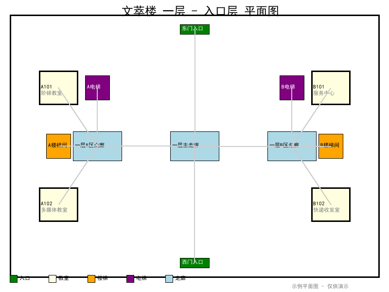 |
| 2F | 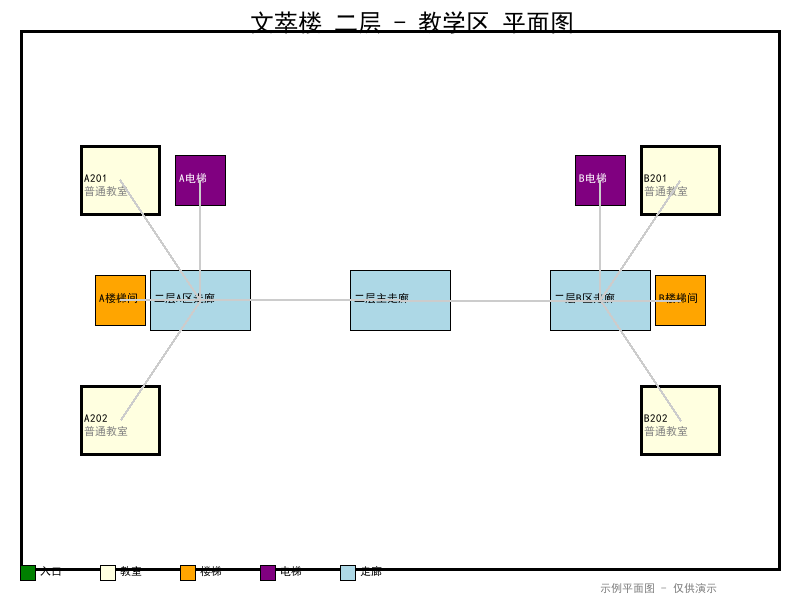 |
| 3F | 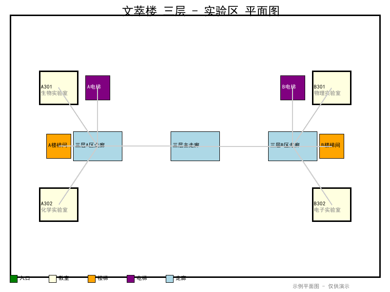 |
| 4F | 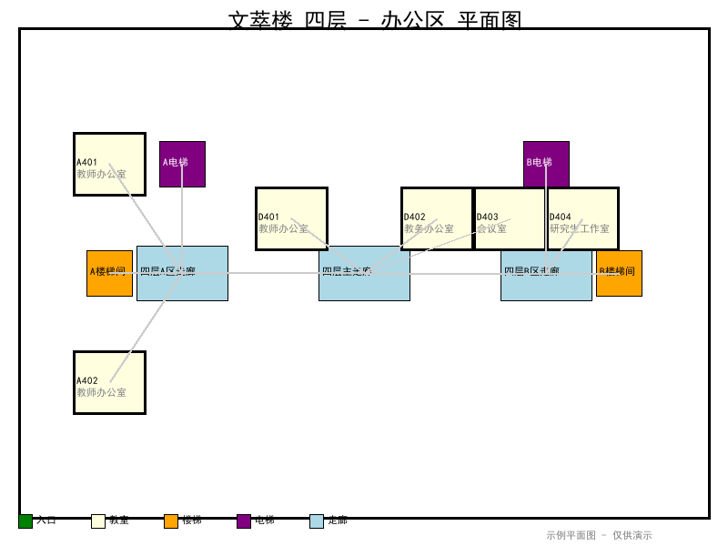 |
| 5F | 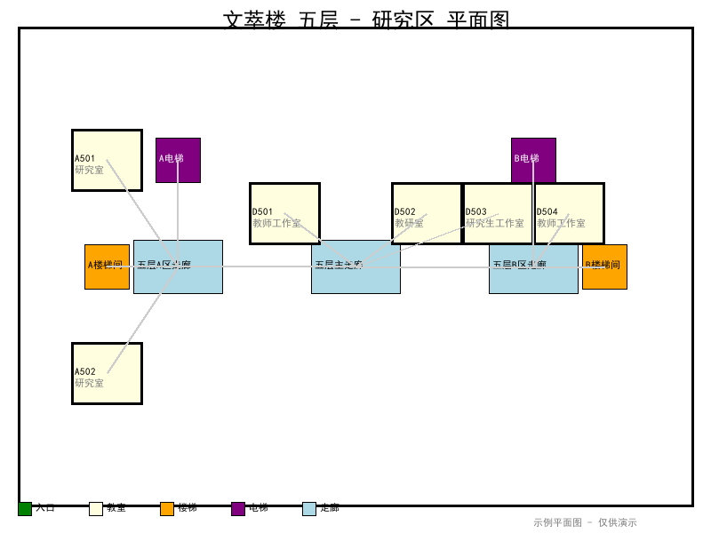 |
| 6F | 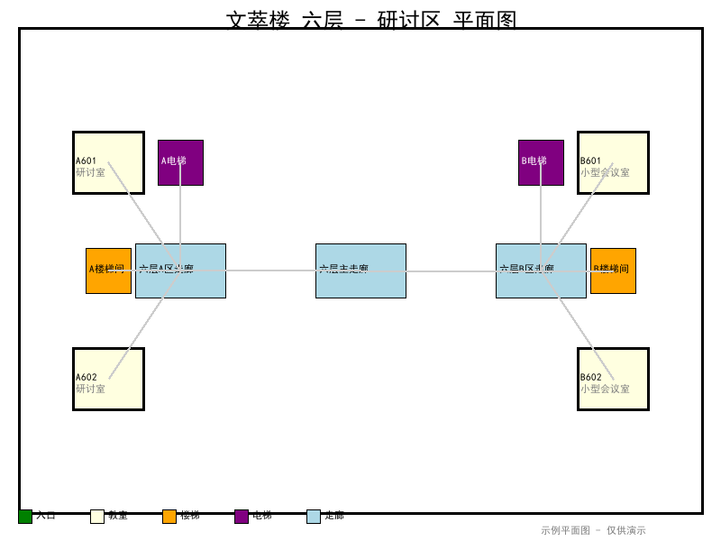 |
| 7F | 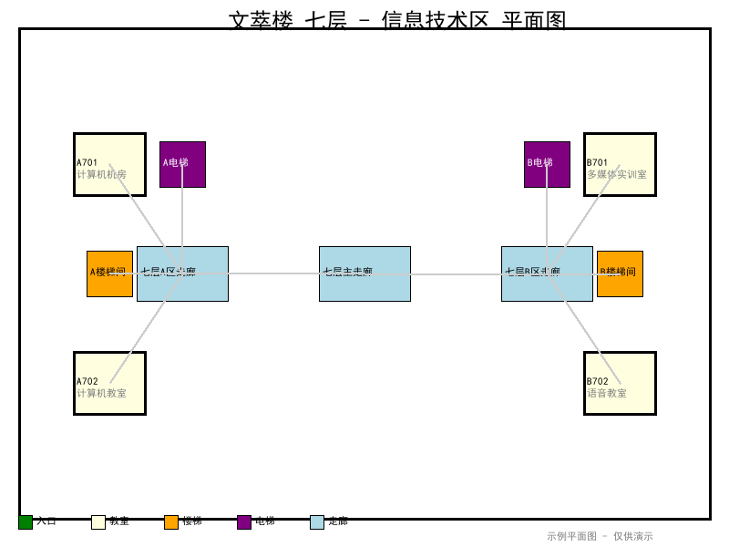 |
| 8F | 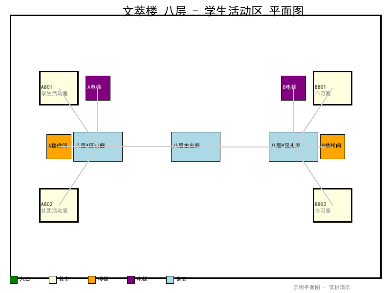 |
| 9F | 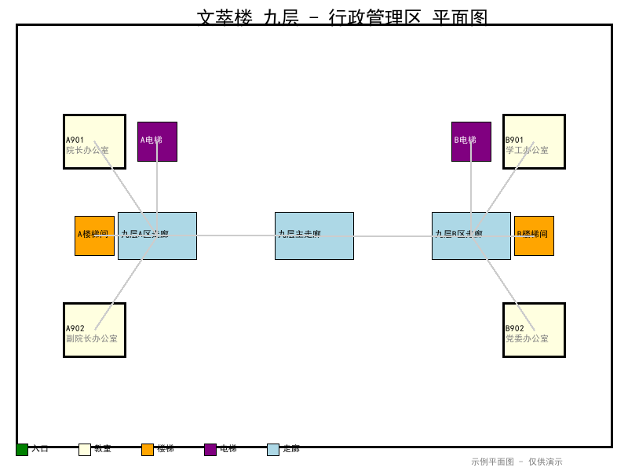 |
| 10F | 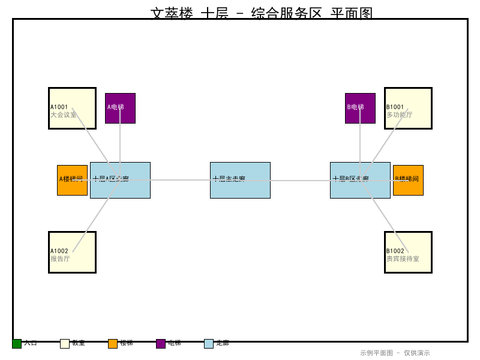 |
